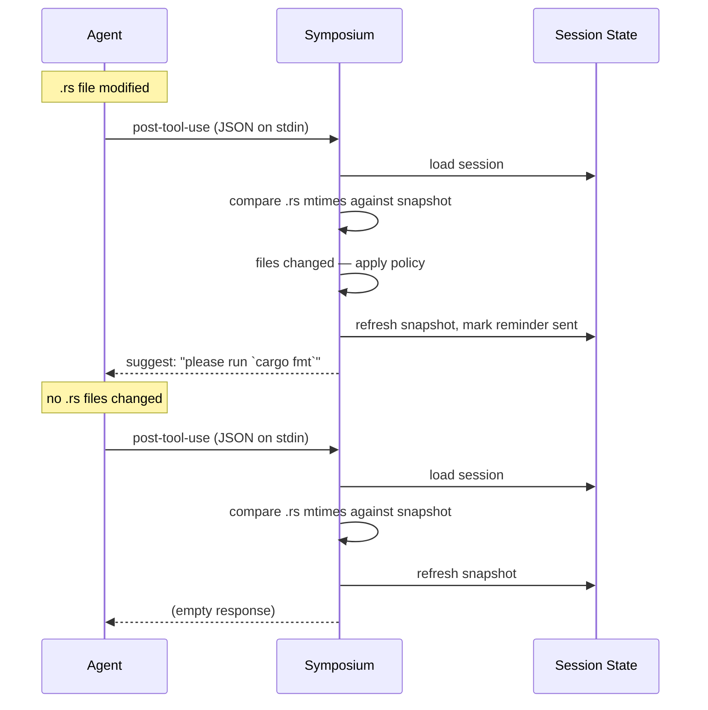

# Cargo fmt reminder flow

When the agent modifies Rust source files, Symposium detects the change and reminds it to run `cargo fmt`. Rather than running the formatter directly, Symposium injects a suggestion into the agent's context via `HookOutput`. The reminder frequency is controlled by the `fmt-reminder` setting in `config.toml` (`once`, `always`, or `never`; default: `once`). To track whether files changed, Symposium loads and stores [session state](./session-state.md).

**PostToolUse** handles the reminder. After each tool use, Symposium walks `cwd` recursively and compares the current `*.rs` file modification times against the snapshot stored in session state. If any files changed and the configured policy allows it, a suggestion is injected into the agent's context. The snapshot is refreshed after every tool use regardless of whether a reminder was sent.
