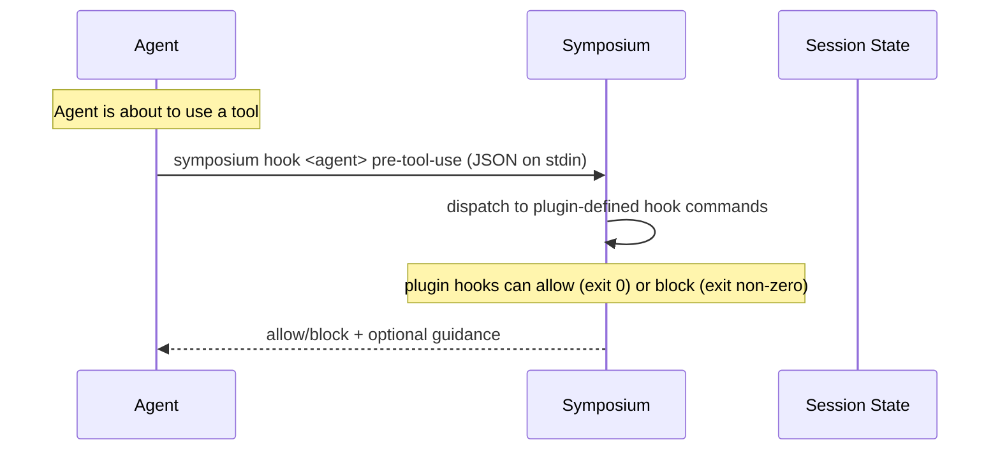

# Cargo workflow

The cargo workflow monitors tools invoked to reduce token usage and (perhaps in the future) trigger other actions.

## Hook flow

Hooks let Symposium react to what the agent is doing. The Claude Code plugin registers three hook events:

**PreToolUse** has no built-in logic — it dispatches to plugin-defined hook commands, which receive the event JSON on stdin and can allow or block the action.
