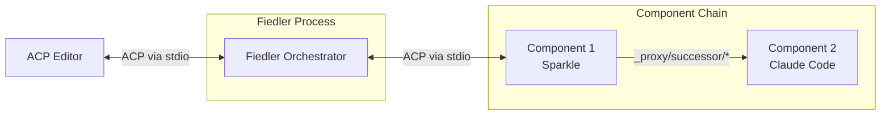
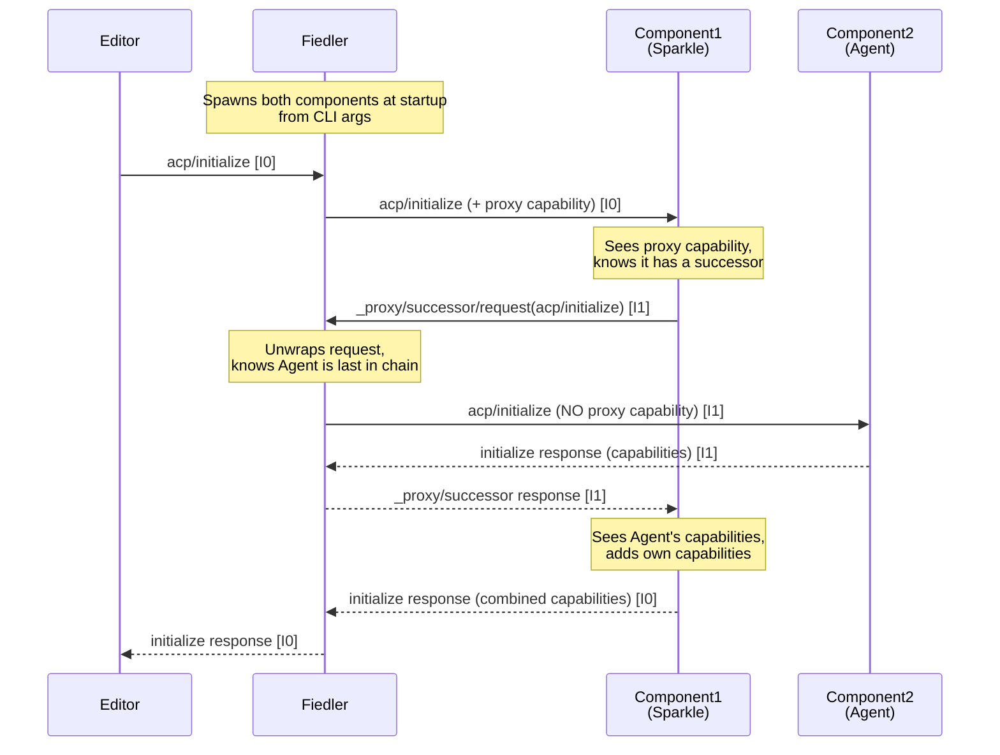

# Conductor: P/ACP Orchestrator

{{#rfd: proxying-acp}}

The **Conductor** (binary name: `conductor`) is the orchestrator for P/ACP proxy chains. Named after Arthur Fiedler, conductor of the Boston Pops, it coordinates the flow of ACP messages through a chain of proxy components.

**Note:** This binary was previously called "Fiedler" and you may see that name in older documentation or code.

## Overview

Fiedler sits between an ACP editor and a chain of components, presenting itself as a normal ACP agent to the editor while managing the proxy chain internally.



**From the editor's perspective**: Fiedler is a normal ACP agent communicating over stdio.

**From the component's perspective**: Each component is initialized by its predecessor and communicates via `_proxy/successor/*` protocol with its successor.

## Responsibilities

The conductor has four core responsibilities:

### 1. Process Management

- Spawns component processes based on command-line arguments
- Manages component lifecycle (startup, shutdown, error handling)
- For MVP: If any component crashes, shut down the entire chain

**Command-line interface:**
```bash
# Agent mode - manages proxy chain
conductor agent sparkle-acp claude-code-acp

# MCP mode - bridges stdio to TCP for MCP-over-ACP
conductor mcp 54321
```

**Agent mode** creates a chain: `Editor → Conductor → sparkle-acp → claude-code-acp`

**MCP mode** bridges MCP JSON-RPC (stdio) to raw JSON-RPC (TCP connection to main conductor)

### 2. Message Routing

Routes messages between editor and components:

**Editor → Component messages:**
- Messages from editor to Fiedler are forwarded to the first component
- Preserves original message ID
- First component initializes subsequent components via `_proxy/successor/*`

**Component → Component messages:**
- Components use `_proxy/successor/request` to send to their successors
- Fiedler doesn't need to route these—components talk directly via stdio pipes

**Response messages:**
- Flow back through the chain automatically via stdio
- Each component can transform responses before passing upstream

### 3. Capability Management

The conductor modifies capability advertisements during initialization:

**When forwarding `acp/initialize` to first component:**
- Adds `_proxy/successor/*` capability if component has a successor
- Removes `_proxy/successor/*` capability if component is the last in chain
- Passes through all other capabilities from editor's request

**MCP bridge capability (`mcp_acp_transport`):**
- Check if final agent advertises `mcp_acp_transport: true`
- If agent lacks capability, conductor activates MCP bridging
- Always advertise `mcp_acp_transport: true` to intermediate components

This allows:
- Each component to see what capabilities its successor offers
- Each component to decide what capabilities to advertise to its predecessor
- The chain to be transparent to the editor

### 4. MCP Bridge Adaptation

When components provide MCP servers with ACP transport (`"url": "acp:$UUID"`):

**If agent has `mcp_acp_transport` capability:**
- Pass through MCP server declarations unchanged
- Agent handles `_mcp/*` messages natively

**If agent lacks `mcp_acp_transport` capability:**
- Bind TCP port for each ACP-transport MCP server
- Transform MCP server spec to use `conductor mcp $port`
- Spawn `conductor mcp $port` bridge processes
- Route MCP tool calls:
  - Agent → stdio → bridge → TCP → conductor → `_mcp/*` messages backward up chain
  - Component responses flow back: component → conductor → TCP → bridge → stdio → agent

See [MCP Bridge](./mcp-bridge.md) for full implementation details.

## Initialization Flow



Key points:
1. **Fiedler spawns ALL components at startup** based on command-line args
2. **Sequential initialization**: Fiedler → Component1 → Component2 → ... → Agent
3. **Capability modification by Fiedler**:
   - Adds `proxy: true` to intermediate components (they have successors)
   - Omits `proxy: true` from last component (no successor)
4. **Components use `_proxy/successor/request`** to initialize their successors
5. **Capabilities flow back up the chain**: Each component sees successor's capabilities before responding
6. **Message IDs**: Preserved from editor (I0), new IDs for proxy messages (I1, I2, ...)

## Architecture

### Core Types

```rust
struct Fiedler {
    /// All components in the chain (spawned at startup)
    components: Vec<ComponentProcess>,
}

struct ComponentProcess {
    name: String,
    child: Child,
    stdin: ChildStdin,
    stdout: BufReader<ChildStdout>,
    stderr: BufReader<ChildStderr>,
}
```

### Message Flow

Fiedler manages message routing between editor and all components:

**Startup:**
1. Parse command-line args to get component list: `["sparkle-acp", "agent-acp"]`
2. Spawn all components, creating stdio pipes for each
3. Wait for messages

**Message routing:**

1. **Editor → Fiedler messages** (from editor's stdin):
   - Forward to **first component** (index 0)
   - Preserve message ID
   - Special case for `acp/initialize`: Add `proxy: true` capability before forwarding

2. **`_proxy/successor/request` from any component**:
   - Determine which component sent it (by reading from that component's stdout)
   - Unwrap the inner message
   - Forward to **next component in chain**
   - Special case: If next component is last, omit `proxy: true` capability

3. **Responses** (JSON-RPC responses, not requests):
   - Match response ID to know which component should receive it
   - Forward appropriately (back toward editor or back to requesting component)

4. **`_proxy/successor/response`** (wrapping a response):
   - Unwrap the inner response
   - Forward back to the component that sent the original `_proxy/successor/request`

### Concurrency Model

For MVP, use a threaded model with message multiplexing:
- **Main thread**: Reads from editor stdin, routes to first component
- **Component reader threads**: One thread per component reading stdout, forwards to appropriate destination
- **Error threads**: One thread per component reading stderr, logs errors

Fiedler needs to track message IDs to route responses correctly:
- When forwarding editor message to Component1: Track `(message_id → editor)`
- When forwarding `_proxy/successor/request`: Track `(message_id → component_index)`

Later optimization: async I/O with tokio for better performance.

## Error Handling

### Component Crashes

If any component process exits or crashes:
1. Log error to stderr
2. Shut down entire Fiedler process
3. Exit with non-zero status

The editor will see the ACP connection close and can handle appropriately.

### Invalid Messages

If Fiedler receives malformed JSON-RPC:
- Log to stderr
- Continue processing (don't crash the chain)
- May result in downstream errors

### Initialization Failures

If component fails to initialize:
1. Log error
2. Return error response to editor
3. Shut down

## Implementation Phases

### Phase 1: Basic Routing (MVP)
- [x] Design documented
- [x] Parse command-line arguments (component list)
- [x] Spawn components recursively (alternative to "spawn all at startup")
- [x] Set up stdio pipes for all components
- [x] Message routing logic:
  - [x] Editor → Component1 forwarding
  - [x] `_proxy/successor/request` unwrapping and forwarding
  - [x] Response routing via context passing (alternative to explicit ID tracking)
  - [x] Component → Editor message routing
- [x] Actor-based message passing architecture with `ConductorMessage` enum
- [x] Error reporting from spawned tasks to conductor
- [ ] **PUNCH LIST - Remaining MVP items:**
  - [ ] Fix typo: `ComnponentToItsClientMessage` → `ComponentToItsClientMessage`
  - [ ] Capability modification during initialization:
    - [ ] Add `_proxy/successor/*` for intermediate components during `acp/initialize`
    - [ ] Omit `_proxy/successor/*` for last component
  - [ ] Add documentation/comments explaining recursive chain building
  - [ ] Add logging (message routing, component startup, errors)
  - [ ] Write tests (basic routing, initialization, error handling)
  - [ ] Component crash detection and chain shutdown

### Phase 2: Robust Error Handling
- [x] Basic error reporting from async tasks
- [ ] Graceful component shutdown
- [ ] Retry logic for transient failures
- [ ] Health checks
- [ ] Timeout handling for hung requests

### Phase 3: Observability
- [ ] Structured logging/tracing
- [ ] Performance metrics
- [ ] Debug mode with message inspection

### Phase 4: Advanced Features
- [ ] Dynamic component loading
- [ ] Hot reload of components
- [ ] Multiple parallel chains

## Testing Strategy

### Unit Tests
- Message parsing and forwarding logic
- Capability modification
- Error handling paths

### Integration Tests
- Full chain initialization
- Message flow through real components
- Component crash scenarios
- Malformed message handling

### End-to-End Tests
- Real editor + Fiedler + test components
- Sparkle + Claude Code integration
- Performance benchmarks

## Open Questions

1. **Component discovery**: How do we find component binaries? PATH? Configuration file?
2. **Configuration**: Should Fiedler support a config file for default chains?
3. **Logging**: Structured logging format? Integration with existing Symposium logging?
4. **Metrics**: Should Fiedler expose metrics (message counts, latency)?
5. **Security**: Do we need to validate/sandbox component processes?

## Related Documentation

- [P/ACP RFD](../rfds/draft/proxying-acp.md) - Full protocol specification
- [Proxying ACP Server Trait](./proxying-acp-server-trait.md) - Component implementation guide
- [Sparkle Component](./sparkle-component.md) - Example P/ACP component
