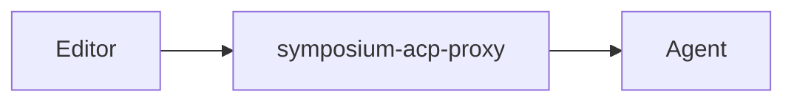
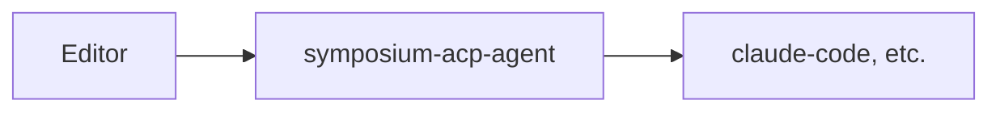

# Implementation Overview

Symposium uses a **conductor** to orchestrate a dynamic chain of component proxies that enrich agent capabilities. This architecture adapts to different client capabilities and provides consistent functionality regardless of what the editor or agent natively supports.

## Two Deployment Modes

Symposium provides two binaries for different deployment scenarios:

### Proxy Mode (`symposium-acp-proxy`)

Sits between an editor and an existing agent, enriching the connection:



Use this when the editor spawns agents separately and you want to insert Symposium's capabilities in between.

### Agent Mode (`symposium-acp-agent`)

Acts as a complete agent that wraps a downstream agent:



Use this when you want a single binary that editors can spawn directly. This is ideal for Zed extensions and similar scenarios where the editor expects to spawn a single agent binary.

Example:
```bash
symposium-acp-agent -- npx -y @zed-industries/claude-code-acp
```

## Internal Structure

Both modes use a [conductor](https://symposium-dev.github.io/symposium-acp/) to orchestrate multiple component proxies:


The conductor dynamically builds this chain based on what capabilities the editor and agent provide.

## Component Pattern

Some Symposium features are implemented as **component/adapter pairs**:

### Components

Components provide functionality to agents through MCP tools and other mechanisms. They:
- Expose high-level capabilities (e.g., Dialect-based IDE operations)
- May rely on primitive capabilities from upstream (the editor)
- Are always included in the chain when their functionality is relevant

### Adapters

Adapters "shim" for missing primitive capabilities by providing fallback implementations. They:
- Check whether required primitive capabilities exist upstream
- Provide the capability if it's missing (e.g., spawn rust-analyzer to provide IDE operations)
- Pass through transparently if the capability already exists
- Are conditionally included only when needed

## Capability-Driven Assembly

During initialization, Symposium:

1. **Receives capabilities from the editor** - examines what the upstream client provides
2. **Queries the agent** - discovers what capabilities the downstream agent supports
3. **Builds the proxy chain** - spawns components and adapters based on detected gaps and opportunities
4. **Advertises enriched capabilities** - tells the editor what the complete chain provides

This approach allows Symposium to work with minimal ACP clients (by providing fallback implementations) while taking advantage of native capabilities when available (by passing through directly).

For detailed information about the initialization sequence and capability negotiation, see [Initialization Sequence](./initialization-sequence.md).
