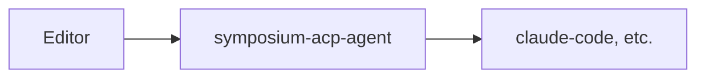

# Implementation Overview

Symposium uses a **conductor** to orchestrate a dynamic chain of component proxies that enrich agent capabilities. This architecture adapts to different client capabilities and provides consistent functionality regardless of what the editor or agent natively supports.

## Deployment Modes

The `symposium-acp-agent` binary supports several subcommands:

### Run Mode (`run`)

The primary way to use Symposium. Reads configuration from `~/.symposium/config.jsonc`:

```bash
symposium-acp-agent run
```

If no configuration exists, runs an interactive setup wizard. See [Run Mode](./run-mode.md) for details.

### Run-With Mode (`run-with`)

For programmatic use by editor extensions. Takes explicit agent and proxy configuration:



Example with agent (wraps downstream agent):
```bash
symposium-acp-agent run-with --proxy defaults --agent '{"name":"...","command":"npx",...}'
```

Example without agent (proxy mode, sits between editor and existing agent):
```bash
symposium-acp-agent run-with --proxy sparkle --proxy ferris
```

## Proxy Configuration

Use `--proxy <name>` to specify which mods to include. Order matters - proxies are chained in the order specified.

Known proxies: `sparkle`, `ferris`, `cargo`

The special value `defaults` expands to all known proxies:
```bash
--proxy defaults           # equivalent to: --proxy sparkle --proxy ferris --proxy cargo
--proxy foo --proxy defaults --proxy bar  # foo, then all defaults, then bar
```

If no `--proxy` flags are given, no proxies are included (pure passthrough).

## Internal Structure

Both modes use a [conductor](https://symposium-dev.github.io/symposium-acp/) to orchestrate multiple component proxies:


The conductor dynamically builds this chain based on what capabilities the editor and agent provide.

## Component Pattern

Some Symposium features are implemented as **component/adapter pairs**:

### Components

Components provide functionality to agents through MCP tools and other mechanisms. They:
- Expose high-level capabilities (e.g., Dialect-based IDE operations)
- May rely on primitive capabilities from upstream (the editor)
- Are always included in the chain when their functionality is relevant

### Adapters

Adapters "shim" for missing primitive capabilities by providing fallback implementations. They:
- Check whether required primitive capabilities exist upstream
- Provide the capability if it's missing (e.g., spawn rust-analyzer to provide IDE operations)
- Pass through transparently if the capability already exists
- Are conditionally included only when needed

## Capability-Driven Assembly

During initialization, Symposium:

1. **Receives capabilities from the editor** - examines what the upstream client provides
2. **Queries the agent** - discovers what capabilities the downstream agent supports
3. **Builds the proxy chain** - spawns components and adapters based on detected gaps and opportunities
4. **Advertises enriched capabilities** - tells the editor what the complete chain provides

This approach allows Symposium to work with minimal ACP clients (by providing fallback implementations) while taking advantage of native capabilities when available (by passing through directly).

For detailed information about the initialization sequence and capability negotiation, see [Initialization Sequence](./initialization-sequence.md).
