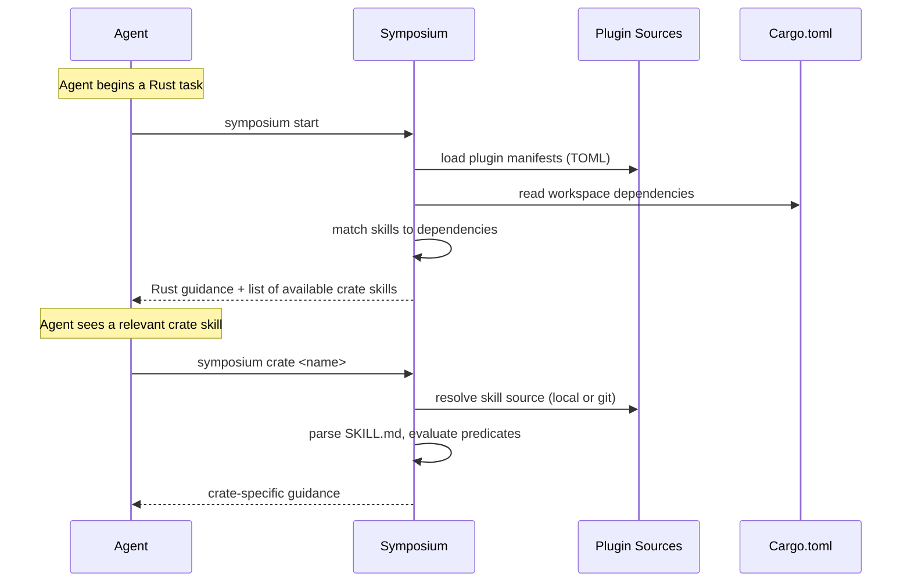
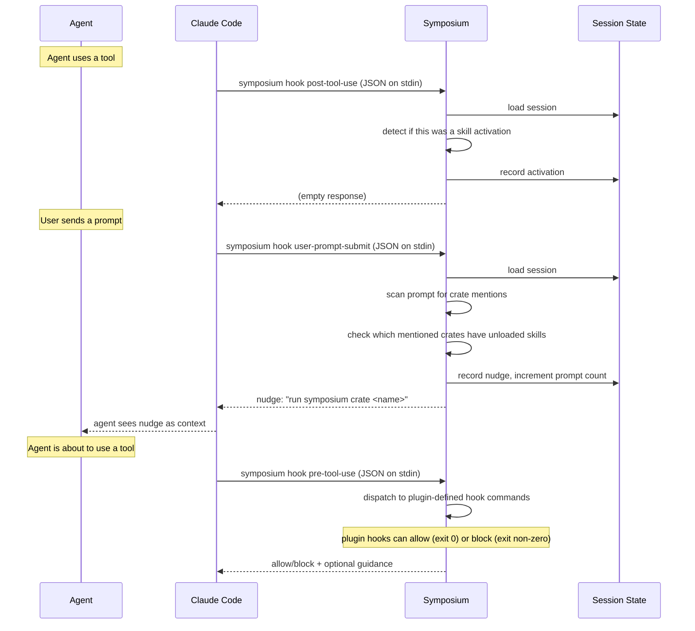

# Important flows

This page traces two key flows: how skills reach the agent, and how hooks react to agent behavior.

## Skill flow

When the agent starts a Rust task, a static skill (installed by the Claude Code plugin) tells it to run `symposium start`. From there:

The start command returns general Rust guidance plus a list of skills that match the workspace's dependencies. The agent can then load individual crate skills as needed. Skills marked `always` are inlined in the start output; `optional` skills are listed with metadata so the agent can choose when to load them.

**Skill resolution** works in layers: plugin sources (configured in `config.toml`) provide plugin manifests, each manifest declares skill groups with crate predicates, and each `SKILL.md` can further narrow with its own `crates` frontmatter. Both levels must match (AND logic), which avoids fetching skill directories that can't possibly apply.

## Hook flow

Hooks let Symposium react to what the agent is doing. The Claude Code plugin registers three hook events:

**PostToolUse** tracks activations. When the agent successfully runs `symposium crate <name>` (via Bash or MCP) or reads a skill file, Symposium records it in the session so it knows which skills have already been loaded.

**UserPromptSubmit** handles nudging. It scans the user's prompt for crate names in code-like contexts (backticks, code blocks, Rust paths like `foo::bar`), checks which of those crates have available skills that haven't been loaded yet, and nudges the agent to load them. Nudges are rate-limited by the configurable `nudge-interval` (default: every 50 prompts).

**PreToolUse** has no built-in logic — it dispatches to plugin-defined hook commands, which receive the event JSON on stdin and can allow or block the action.

Session state (activations, nudge history, prompt count) is persisted as JSON files at `~/.symposium/sessions/<session-id>.json`, so state survives across hook invocations within a single coding session.
