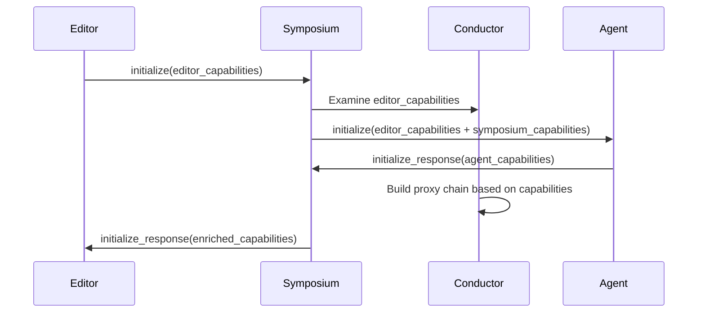

# Initialization Sequence

This chapter describes how Symposium negotiates capabilities during initialization and builds its internal proxy chain.

## Overview

Symposium's initialization happens in two phases:

1. **Capability Discovery** - Symposium receives capabilities from the upstream editor and downstream agent
2. **Chain Assembly** - The conductor spawns the appropriate component proxies based on detected capabilities

## ACP Initialization Message Flow

The Agent Communication Protocol (ACP) initialization follows this sequence:



### Initialization Request

When the editor connects to Symposium, it sends an `initialize` request containing:

- **Client capabilities** - What the editor natively supports (e.g., `fs_read`, `fs_write`, `ide_operations`)
- **Client information** - Editor identification and version
- **Workspace information** - Current working directory and workspace structure

Symposium forwards this initialization downstream to the agent, adding Symposium's own capabilities to the set.

### Initialization Response

The agent responds with its own capabilities, including:

- **Server capabilities** - What the agent can provide
- **Protocol version** - ACP version support
- **Extensions** - Any protocol extensions the agent supports

Symposium receives this response and uses it to inform the proxy chain assembly.

## Capability Examination

The conductor examines capabilities from both directions to make assembly decisions:

### Upstream Capabilities (from Editor)

The conductor checks what primitive capabilities the editor provides. These might include:

- File system operations (`fs_read`, `fs_write`)
- IDE operations (`ide_operations`) 
- Terminal access (`bash`)
- Other editor-specific capabilities

**Purpose:** Determine which adapters are needed. If the editor lacks a primitive capability that a component requires, spawn an adapter to provide it.

### Downstream Capabilities (from Agent)

The agent's initialization response includes its capabilities. While Symposium currently forwards these without examining them for assembly decisions, the architecture allows for future capability-based optimizations (such as omitting components when the agent doesn't use their features).

### Capability Convention

Capabilities are stored in the `_meta.symposium` section of the ACP initialization message. Components use the `MetaCapabilityExt` trait from the `sacp` crate to declare and check for capabilities:

```rust
struct IdeOperations;

impl MetaCapability for IdeOperations {
    fn key(&self) -> &'static str { "ide_operations" }
}
```

This convention allows components to query for capabilities consistently:

```rust
if init_params.has_capability::<IdeOperations>() {
    // Editor provides IDE operations
} else {
    // Need to spawn adapter
}
```

## Chain Assembly

After examining both sides, the conductor dynamically builds the proxy chain:

1. **Determine required components** - Based on agent capabilities and Symposium features
2. **Identify missing primitives** - Check which required capabilities the editor lacks
3. **Spawn adapters** - For each missing primitive, spawn an adapter to provide it
4. **Spawn components** - Spawn components that enrich the available capabilities
5. **Connect the chain** - Wire up the proxy chain from editor → adapters → components → agent

The result is a chain that provides consistent functionality regardless of what the editor natively supports.

## Example: IDE Operations

Consider initialization when the IDE Operations feature is enabled:

**If editor provides `ide_operations`:**
1. Conductor sees `ide_operations` in upstream capabilities
2. Spawns only the IDE Operations Component
3. Component enriches the capability to provide MCP tools to agent
4. Chain: `Editor → IDE Ops Component → Agent`

**If editor lacks `ide_operations`:**
1. Conductor sees `ide_operations` missing from upstream capabilities  
2. Spawns IDE Ops Adapter to provide the missing capability
3. Spawns IDE Ops Component to enrich it to MCP tools
4. Chain: `Editor → IDE Ops Adapter → IDE Ops Component → Agent`

In both cases, the agent receives the same MCP tools for IDE operations.

## Capability Advertisement

After assembling the proxy chain, Symposium responds to the editor's initialization with enriched capabilities that include:

- Original editor capabilities
- Capabilities provided by adapters
- Capabilities provided by components
- Symposium meta-capabilities

This allows the editor to understand the complete set of functionality available through the Symposium proxy.
