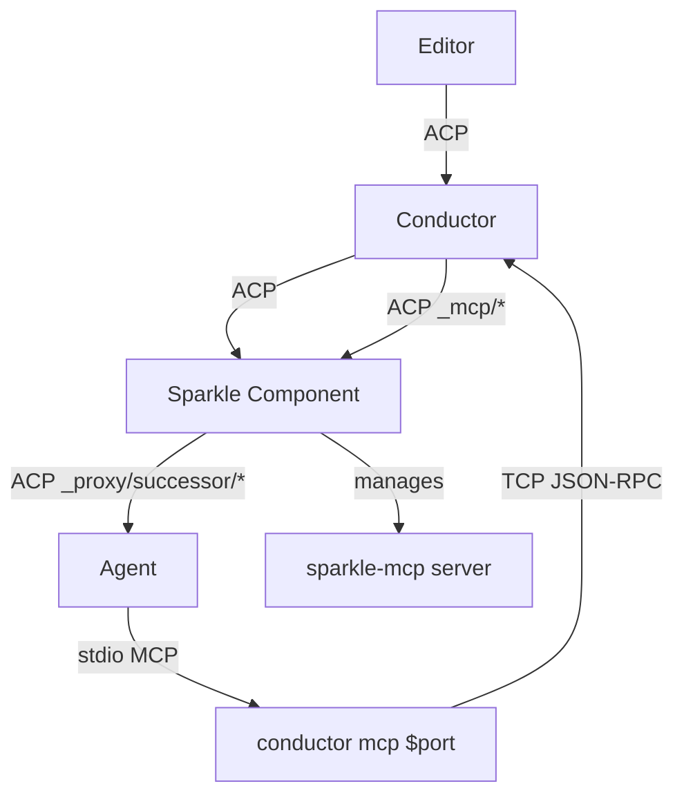

# MCP Bridge Implementation Guide

{{#rfd: proxying-acp}}

The **MCP Bridge** enables P/ACP components to provide MCP servers that communicate over ACP messages rather than traditional stdio. This allows components to handle MCP tool calls without agents needing P/ACP awareness.

## Overview

The MCP bridge solves a key integration challenge: enabling components to provide MCP tools to agents that don't natively support MCP-over-ACP transport.

**Architecture:**



**Key insight:** The agent thinks it's talking to a normal MCP server over stdio, but `conductor mcp $port` bridges to the main conductor via TCP, which translates to ACP messages that flow backward up the proxy chain to the component.

## Protocol Components

### 1. MCP Server Declaration

Components declare MCP servers with ACP transport using HTTP format with special URL:

```json
{
  "tools": {
    "mcpServers": {
      "sparkle": {
        "transport": "http",
        "url": "acp:550e8400-e29b-41d4-a716-446655440000",
        "headers": {}
      }
    }
  }
}
```

**Key points:**
- `transport: "http"` is used as a hack (will be formalized in ACP spec)
- `url: "acp:$UUID"` signals ACP transport
- Component generates UUID to identify itself as the handler
- `headers: {}` is required but empty

### 2. Capability Advertisement

Agents declare native ACP transport support:

```json
{
  "_meta": {
    "mcp_acp_transport": true
  }
}
```

**Conductor behavior:**
- If final agent has capability → pass through unchanged, no bridging needed
- If final agent lacks capability → activate bridge adaptation
- Always advertise `mcp_acp_transport: true` to intermediate components

### 3. Bridging Transformation

When bridging is needed, conductor transforms MCP server specs:

**Input (from component):**
```json
{
  "sparkle": {
    "transport": "http",
    "url": "acp:550e8400-e29b-41d4-a716-446655440000",
    "headers": {}
  }
}
```

**Output (to agent):**
```json
{
  "sparkle": {
    "command": "conductor",
    "args": ["mcp", "54321"],
    "transport": "stdio"
  }
}
```

**What happens:**
1. Conductor binds TCP port 54321 and listens
2. Conductor spawns `conductor mcp 54321` as child process
3. `conductor mcp 54321` connects to `localhost:54321` via TCP
4. Agent spawns what it thinks is a normal MCP server
5. Tool calls flow: Agent → stdio → `conductor mcp` → TCP → main conductor → ACP `_mcp/*` messages

### 4. Message Flow Protocol

#### Client→Server Messages (Backward Flow)

Agent calls MCP tool → flows backward up proxy chain:

**`_mcp/client_to_server/request`:**
```json
{
  "jsonrpc": "2.0",
  "id": "T1",
  "method": "_mcp/client_to_server/request",
  "params": {
    "url": "acp:550e8400-...",
    "message": {
      "jsonrpc": "2.0",
      "id": "mcp-123",
      "method": "tools/call",
      "params": {
        "name": "embody_sparkle",
        "arguments": {}
      }
    }
  }
}
```

**Response:**
```json
{
  "jsonrpc": "2.0",
  "id": "T1",
  "result": {
    "message": {
      "jsonrpc": "2.0",
      "id": "mcp-123",
      "result": {
        "content": [...]
      }
    }
  }
}
```

**`_mcp/client_to_server/notification`:**
```json
{
  "jsonrpc": "2.0",
  "method": "_mcp/client_to_server/notification",
  "params": {
    "url": "acp:550e8400-...",
    "message": {
      "jsonrpc": "2.0",
      "method": "notifications/cancelled",
      "params": {}
    }
  }
}
```

#### Server→Client Messages (Forward Flow)

MCP server callbacks → flow forward down proxy chain:

**`_mcp/server_to_client/request`:**
```json
{
  "jsonrpc": "2.0",
  "id": "S1",
  "method": "_mcp/server_to_client/request",
  "params": {
    "url": "acp:550e8400-...",
    "message": {
      "jsonrpc": "2.0",
      "id": "mcp-456",
      "method": "sampling/createMessage",
      "params": {
        "messages": [...],
        "modelPreferences": {...}
      }
    }
  }
}
```

**`_mcp/server_to_client/notification`:**
```json
{
  "jsonrpc": "2.0",
  "method": "_mcp/server_to_client/notification",
  "params": {
    "url": "acp:550e8400-...",
    "message": {
      "jsonrpc": "2.0",
      "method": "notifications/progress",
      "params": {
        "progressToken": "token-1",
        "progress": 50,
        "total": 100
      }
    }
  }
}
```

## Implementation Details

### Conductor Agent Mode Responsibilities

When managing the proxy chain, conductor must:

1. **Detect ACP transport MCP servers** during `session/new`
   - Look for `"transport": "http"` with `"url": "acp:..."`
   - Check if final agent has `mcp_acp_transport` capability

2. **Activate bridging if needed:**
   - Bind fresh TCP port (use ephemeral port allocation)
   - Store mapping: `UUID → port`
   - Transform MCP server spec to use `conductor mcp $port`
   - Spawn `conductor mcp $port` as child process

3. **Route `_mcp/*` messages:**
   - **Client→Server**: Receive from bridge via TCP, wrap in ACP, send backward up chain
   - **Server→Client**: Receive from component via ACP, unwrap, send to bridge via TCP

4. **Manage bridge lifecycle:**
   - Spawn bridge processes when session starts
   - Clean up when session ends or component crashes
   - Handle bridge process crashes gracefully

### Conductor MCP Mode Responsibilities

When running as an MCP bridge (`conductor mcp $port`):

1. **Connect to main conductor:**
   - Connect TCP socket to `localhost:$port`
   - Handle connection failures with retry logic
   - Maintain persistent connection

2. **Bridge stdio ↔ TCP:**
   - Read MCP JSON-RPC from stdin
   - Forward to main conductor via TCP
   - Read responses from TCP
   - Write to stdout

3. **Handle both directions:**
   - Agent → MCP server (client→server)
   - MCP server → Agent (server→client callbacks)

4. **Protocol transparency:**
   - No modification of MCP messages
   - Pure transport layer bridging
   - Preserve message IDs and structure

### Component Responsibilities

Components that provide MCP servers via ACP transport must:

1. **Generate UUIDs** for their MCP servers
   - Use proper UUID generation (e.g., `uuid::Uuid::new_v4()`)
   - Store mapping: `UUID → MCP server instance`

2. **Declare MCP servers** with ACP transport in `session/new`
   - Use `"transport": "http"` format
   - Include `"url": "acp:$UUID"`

3. **Intercept `_mcp/client_to_server/*` messages:**
   - Match on `params.url` against known UUIDs
   - Extract `params.message`
   - Forward to actual MCP server instance
   - Wrap response and send back down chain

4. **Initiate `_mcp/server_to_client/*` messages:**
   - When MCP server needs to callback (sampling, logging, etc.)
   - Wrap MCP message in ACP envelope
   - Send forward down the chain toward agent

## TCP Protocol

The conductor uses raw TCP for bridge communication (not HTTP):

**Message framing:**
- Newline-delimited JSON-RPC messages
- Each message is a complete JSON object followed by `\n`
- Simple and efficient for localhost communication

**Connection lifecycle:**
1. `conductor mcp` connects to port
2. Main conductor accepts connection
3. Both directions use same socket (full duplex)
4. Connection persists for session lifetime
5. Either side can initiate messages

**Error handling:**
- Connection failures → retry with exponential backoff
- Parse errors → log and continue
- Socket errors → attempt reconnection

## Port Allocation

**Strategy for MVP:**
- Use OS-provided ephemeral ports
- Bind to `localhost:0` → OS assigns free port
- Extract assigned port number
- Pass to `conductor mcp $port` subprocess

**Future considerations:**
- Port range configuration
- Port reuse between sessions
- Multiple MCP servers per session (multiple bridges)

## Testing Strategy

### Unit Tests

**Protocol message serialization:**
- Test `_mcp/*` message parsing
- Test URL matching (`acp:$UUID`)
- Test message wrapping/unwrapping

**Transformation logic:**
- Test MCP server spec transformation
- Test capability detection
- Test UUID generation

### Integration Tests

**Bridge functionality:**
- Spawn real conductor in both modes
- Send MCP messages through bridge
- Verify correct routing and response

**Component integration:**
- Test component declaring ACP transport MCP server
- Test tool call routing to component
- Test server→client callbacks

### End-to-End Tests

**Full chain with MCP bridge:**
- Editor → Conductor → Sparkle → Agent (without `mcp_acp_transport`)
- Verify Sparkle tools work correctly
- Test embodiment sequence via MCP tool call
- Verify bridge cleanup on session end

## Example: Sparkle Component

See how Sparkle component uses MCP bridge:

1. **Declare MCP server:**
   ```rust
   let uuid = Uuid::new_v4();
   let mcp_server = McpServer {
       transport: "http",
       url: format!("acp:{}", uuid),
       headers: HashMap::new(),
   };
   ```

2. **Add to session:**
   ```rust
   fn on_session_new(&mut self, req: SessionNewRequest) {
       let mut tools = req.tools;
       tools.mcp_servers.insert("sparkle".into(), mcp_server);
       self.forward_to_successor(SessionNewRequest { tools, ..req });
   }
   ```

3. **Handle tool calls:**
   ```rust
   fn on_mcp_client_to_server_request(&mut self, req: McpClientToServerRequest) {
       if req.url == format!("acp:{}", self.sparkle_uuid) {
           // Extract MCP message, handle tool call
           let mcp_msg = req.message;
           let response = self.sparkle_mcp.handle_call(mcp_msg);
           // Wrap and respond
           self.respond(McpResponse { message: response });
       } else {
           // Not for us, forward backward up chain
           self.forward_backward(req);
       }
   }
   ```

## Related Documentation

- [P/ACP RFD](../rfds/draft/proxying-acp.md) - Full protocol specification
- [Fiedler/Conductor Design](./fiedler-conductor.md) - Conductor architecture
- [P/ACP Components](./pacp-components.md) - Component development guide
