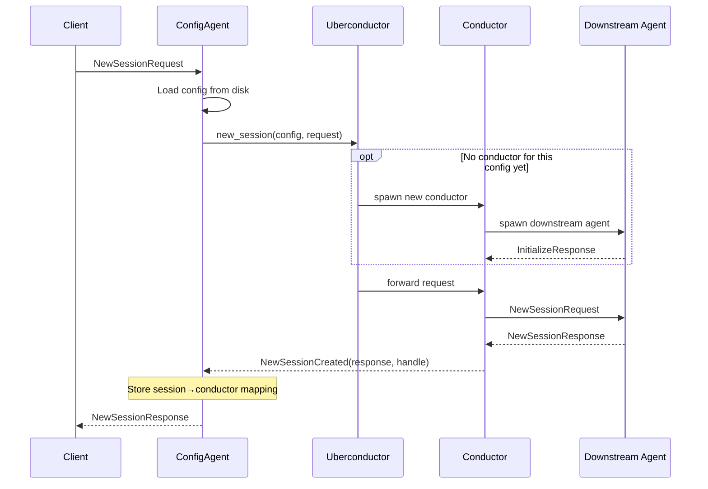
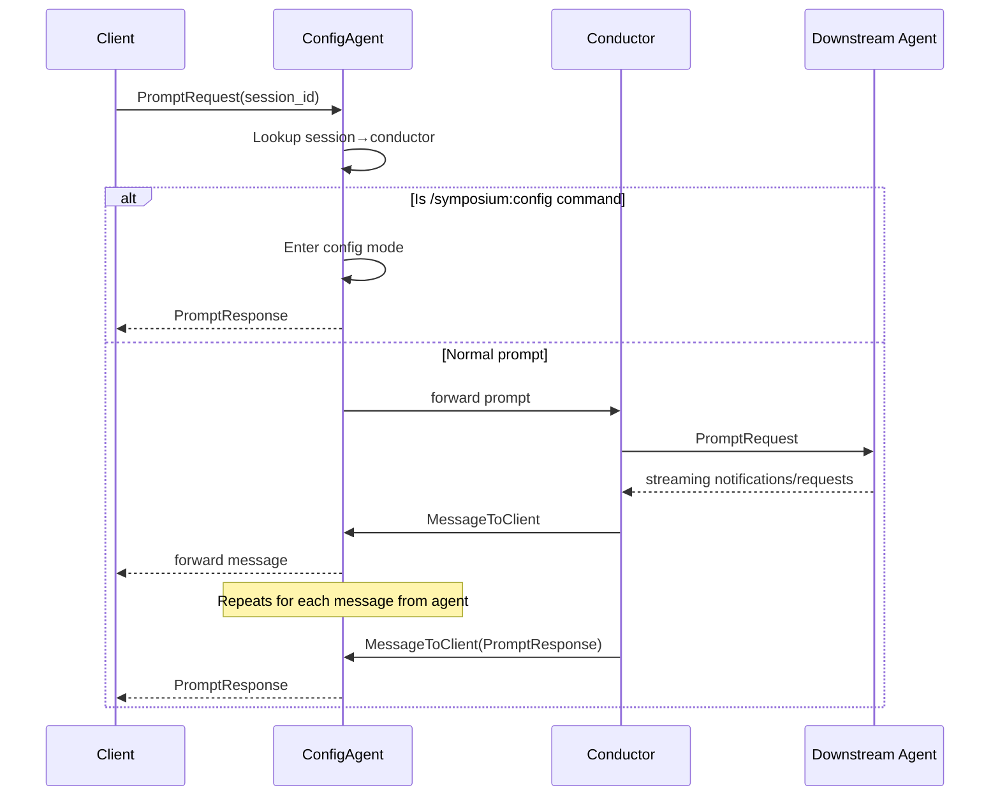
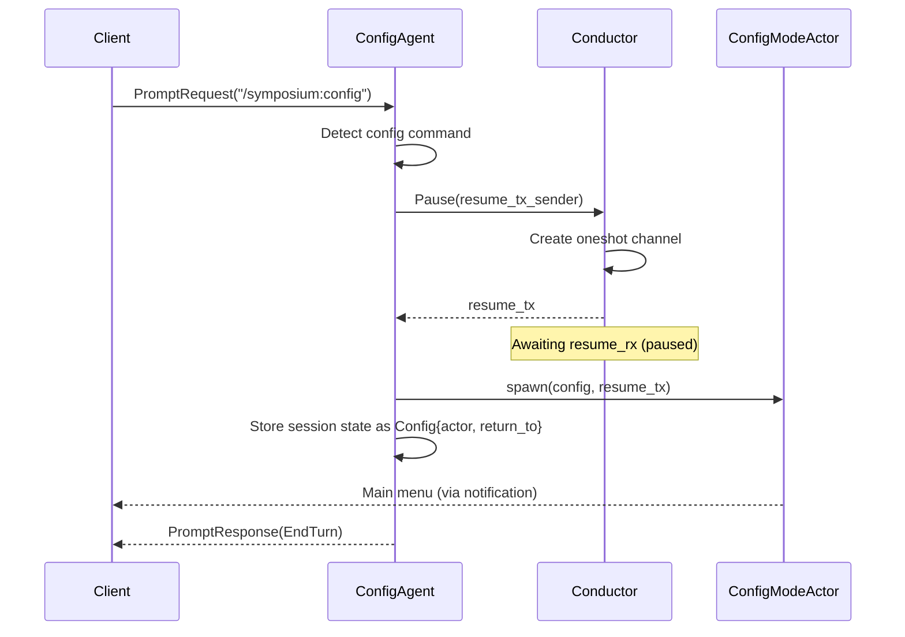
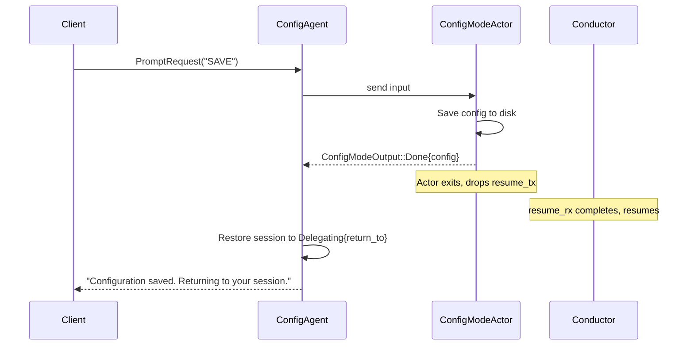

# Run Mode

The `run` subcommand simplifies editor integration by reading agent configuration from a file rather than requiring command-line arguments.

## Configuration File

**Location:** `~/.symposium/config.jsonc`

The file uses JSONC (JSON with comments) format:

```jsonc
{
  // Downstream agent command (parsed as shell words)
  "agent": "npx -y @zed-industries/claude-code-acp",
  
  // Proxy extensions to enable
  "proxies": [
    { "name": "sparkle", "enabled": true },
    { "name": "ferris", "enabled": true },
    { "name": "cargo", "enabled": true }
  ]
}
```

### Fields

| Field | Type | Description |
|-------|------|-------------|
| `agent` | string | Shell command to spawn the downstream agent. Parsed using shell word splitting. |
| `proxies` | array | List of proxy mods with `name` and `enabled` fields. |

## Architecture: Three-Actor Pattern

The `run` command uses a **ConfigAgent** that manages configuration and delegates sessions to conductors. The architecture uses three actors to separate concerns:

```
Client (editor)
    │
    ▼
┌─────────────────────────────────────────────────────────┐
│ ConfigAgent                                             │
│   • Handles InitializeRequest                           │
│   • Intercepts /symposium:config slash command          │
│   • Routes messages by session ID                       │
│   • Spawns ConfigModeActor for config UI                │
└─────────────────────────────────────────────────────────┘
    │
    ▼
┌─────────────────────────────────────────────────────────┐
│ UberconductorActor                                      │
│   • Manages conductor lifecycle                         │
│   • Groups sessions by config (deduplication)           │
│   • Creates new conductors when config changes          │
└─────────────────────────────────────────────────────────┘
    │
    ▼
┌─────────────────────────────────────────────────────────┐
│ ConductorActor (one per unique config)                  │
│   • Owns proxy chain + downstream agent process         │
│   • Handles multiple sessions                           │
│   • Forwards messages bidirectionally                   │
└─────────────────────────────────────────────────────────┘
    │
    ▼
Downstream Agent (claude-code, etc.)
```

### Why Three Actors?

**ConfigAgent** owns the client connection and must respond to requests. But creating a conductor requires async initialization (spawning processes, capability negotiation). The three-actor pattern solves this:

1. **ConfigAgent** - Stateful message router. Owns session-to-conductor mapping and responds to clients.
2. **UberconductorActor** - Conductor factory. Manages conductor lifecycle and deduplicates by config.
3. **ConductorActor** - Session handler. Owns the actual proxy chain and downstream agent.

This separation ensures ConfigAgent never blocks waiting for conductor initialization.

### New Session Flow

When a client requests a new session:



Key insight: The conductor sends `NewSessionCreated` back to ConfigAgent *carrying the request context*. This ensures ConfigAgent stores the session mapping *before* responding to the client, avoiding race conditions.

### Prompt Routing

Once a session is established, prompts route through ConfigAgent:



All messages from conductors flow back through ConfigAgent as `MessageToClient`. This allows ConfigAgent to intercept and modify messages (e.g., injecting the `/symposium:config` command into `AvailableCommandsUpdate` notifications).

### Session-to-Conductor Mapping

The ConfigAgent groups sessions by configuration:

- When a new session starts, ConfigAgent loads the current config from disk
- UberconductorActor checks if a Conductor already exists for that config (compared by equality)
- If not, a new Conductor is spawned, initialized, and the session is delegated to it

This means:
- Multiple sessions with the same config share a Conductor
- Config changes take effect on the next session, not immediately
- Existing sessions continue with their original config

## Configuration Mode

Users can modify configuration at any time via the `/symposium:config` slash command.

### Entering Config Mode

When ConfigAgent detects the config command in a prompt, it pauses the conductor before entering config mode. This ensures the conductor doesn't process any messages from the downstream agent while the user is configuring.



The pause/resume protocol:
1. ConfigAgent sends `Pause` to conductor with a channel to receive `resume_tx`
2. Conductor creates a oneshot channel, sends `resume_tx` back, then awaits `resume_rx`
3. ConfigModeActor holds `resume_tx` - when it exits, dropping `resume_tx` signals the conductor to resume
4. While paused, the conductor processes no messages

The session transitions from `Delegating{conductor}` to `Config{actor, return_to}`. The `return_to` field preserves the conductor handle so we can resume the session after config mode exits.

### Config Mode UI

ConfigModeActor presents an interactive "phone tree" menu:

```
## Current Configuration

**Agent:** Claude Code

**Mods:**
1. [x] sparkle
2. [x] ferris
3. [x] cargo

## Commands

- `SAVE` - Save changes and exit
- `CANCEL` - Discard changes and exit
- `A` or `AGENT` - Change agent
- `1`, `2`, `3` - Toggle mod on/off
- `move X to Y` - Reorder mods
```

The actor uses **async control flow as a state machine**: nested async loops replace explicit state enums. Each submenu (like agent selection) is a function that awaits input and returns when complete.

Commands return a `MenuAction` to control redisplay:
- `Done` - Exit config mode entirely
- `Redisplay` - Show the menu again (after successful command)
- `Continue` - Don't redisplay (for invalid input, just wait for next)

### Exiting Config Mode

When the user saves or cancels, the ConfigModeActor exits and drops `resume_tx`, which signals the conductor to resume:



## First-Time Setup

When no configuration file exists, ConfigAgent enters `InitialSetup` state instead of delegating to a conductor. The setup flow:

1. Fetches available agents from the [ACP Agent Registry](https://github.com/agentclientprotocol/registry)
2. Presents a numbered list of agents
3. User types a number to select
4. Saves configuration with all proxies enabled by default
5. Transitions to normal operation

## Implementation

| Component | Location | Purpose |
|-----------|----------|---------|
| `ConfigAgent` | `config_agent/mod.rs` | Message routing and session state |
| `UberconductorActor` | `config_agent/uberconductor_actor.rs` | Conductor lifecycle management |
| `ConductorActor` | `config_agent/conductor_actor.rs` | Proxy chain and agent process |
| `ConfigModeActor` | `config_agent/config_mode_actor.rs` | Interactive config UI |
| `SymposiumUserConfig` | `user_config.rs` | Config file parsing and persistence |

### Dependencies

| Crate | Purpose |
|-------|---------|
| `serde_jsonc` | Parse JSON with comments |
| `shell-words` | Parse agent command string into arguments |
| `dirs` | Cross-platform home directory resolution |
