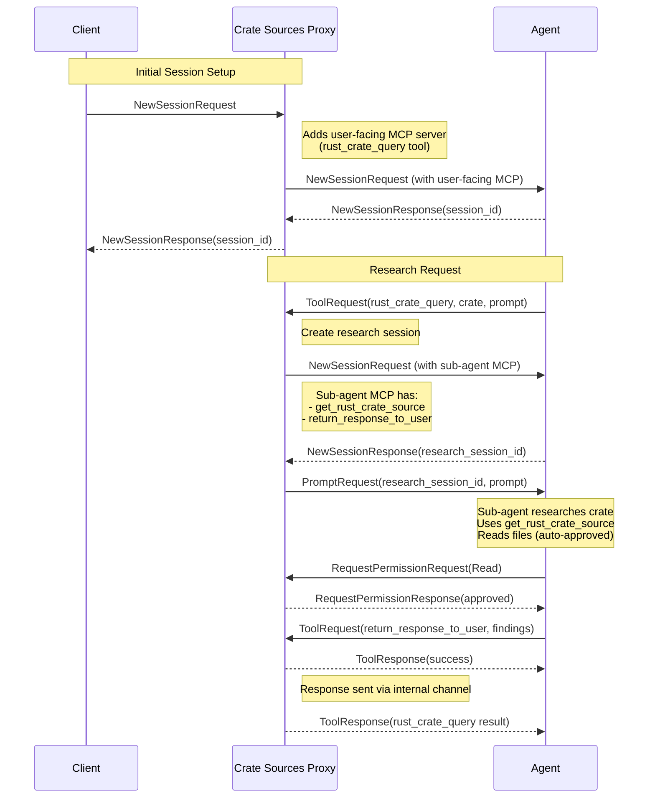

# Rust Crate Sources Component

The Rust Crate Sources component provides agents with the ability to research published Rust crate source code through a sub-agent architecture.

## Architecture Overview

The component uses a **sub-agent research pattern**: when an agent needs information about a Rust crate, the component spawns a dedicated research session with its own agent to investigate the crate sources and return findings.

### Message Flow



### Two MCP Servers

The component provides two distinct MCP servers:

1. **User-facing MCP Server** - Exposed to the main agent session
   - Tool: `rust_crate_query` - Initiates crate research

2. **Sub-agent MCP Server** - Provided only to research sessions
   - Tool: `get_rust_crate_source` - Locates crate sources and returns path
   - Tool: `return_response_to_user` - Returns research findings and ends the session

## User-Facing Tool: `rust_crate_query`

### Parameters

```typescript
{
  crate_name: string,      // Name of the Rust crate
  crate_version?: string,  // Optional semver range (defaults to latest)
  prompt: string           // What to research about the crate
}
```

### Examples

```json
{
  "crate_name": "serde",
  "prompt": "How do I use the derive macro for custom field names?"
}
```

```json
{
  "crate_name": "tokio",
  "crate_version": "1.0",
  "prompt": "What are the signatures of all methods on tokio::runtime::Runtime?"
}
```

### Behavior

1. Creates a new research session via `NewSessionRequest`
2. Attaches the sub-agent MCP server to that session
3. Sends the user's prompt via `PromptRequest`
4. Waits for the sub-agent to call `return_response_to_user`
5. Returns the sub-agent's findings as the tool result

## Sub-Agent Tools

### `get_rust_crate_source`

Locates and extracts the source code for a Rust crate from crates.io.

**Parameters:**
```typescript
{
  crate_name: string,
  version?: string  // Semver range
}
```

**Returns:**
```json
{
  "crate_name": "serde",
  "version": "1.0.210",
  "checkout_path": "/Users/user/.cargo/registry/src/.../serde-1.0.210",
  "message": "Crate 'serde' version 1.0.210 extracted to ..."
}
```

The sub-agent can then use Read tool calls (which are auto-approved) to examine the source code.

### `return_response_to_user`

Signals completion of the research and returns findings to the waiting `rust_crate_query` call.

**Parameters:**
```typescript
{
  response: string  // The research findings to return
}
```

**Behavior:**
- Sends the response through an internal channel to the waiting tool handler
- The original `rust_crate_query` call completes with this response
- The research session can then be terminated

## Permission Auto-Approval

The component implements a message handler that intercepts `RequestPermissionRequest` messages from research sessions and automatically approves all permission requests.

### Permission Rules

- **Research sessions** → All permissions automatically approved
- **Other sessions** → Passed through unchanged

### Rationale

Research sessions are sandboxed and disposable - they investigate crate sources and return findings. Auto-approving all permissions eliminates the need for dozens of permission prompts while maintaining safety:

- Research sessions operate on read-only crate sources in the cargo registry cache
- Sessions are short-lived and focused on a single research task
- Any side effects are contained within the research session's scope

### Implementation

The handler checks if a permission request comes from a registered research session and automatically selects the first available option (typically "allow"):

```rust
if self.state.is_research_session(&req.session_id) {
    // Select first option (typically "allow")
    let response = RequestPermissionResponse {
        outcome: RequestPermissionOutcome::Selected {
            option_id: req.options.first().unwrap().id.clone(),
        },
        meta: None,
    };
    request_cx.respond(response)?;
    return Ok(Handled::Yes);
}
return Ok(Handled::No(message));  // Not our session, propagate unchanged
```

## Session Lifecycle

1. **Agent calls `rust_crate_query`**
   - Handler creates `oneshot::channel()` for response
   - Registers session in active sessions map

2. **Handler sends `NewSessionRequest`**
   - Includes sub-agent MCP server configuration
   - Receives `session_id` in response

3. **Handler sends `PromptRequest`**
   - Sends user's research prompt to the session
   - Awaits response on the oneshot channel

4. **Sub-agent performs research**
   - Calls `get_rust_crate_source` to locate crate
   - Reads source files (auto-approved by permission handler)
   - Analyzes code to answer the prompt

5. **Sub-agent calls `return_response_to_user`**
   - Sends findings through internal channel
   - Original `rust_crate_query` call receives response

6. **Session cleanup**
   - Remove session from active sessions map
   - Session termination (if ACP supports explicit session end)

## Shared State

The component uses shared state to coordinate between:
- The `rust_crate_query` tool handler (creates sessions, waits for responses)
- The `return_response_to_user` tool handler (sends responses)
- The permission request handler (auto-approves Read operations)

### State Structure

```rust
struct ResearchSession {
    session_id: SessionId,
    response_tx: oneshot::Sender<String>,
}

// Shared across all handlers
Arc<Mutex<HashMap<SessionId, ResearchSession>>>
```

## Design Decisions

### Why Sub-Agents Instead of Direct Pattern Search?

**Previous approach:** The component exposed `get_rust_crate_source` with a `pattern` parameter that performed regex searches across crate sources.

**Problems:**
- Agents had to construct exact regex patterns
- Limited to simple pattern matching
- No semantic understanding of code structure
- Single-shot queries couldn't follow up on findings

**Sub-agent approach:**
- Agent describes what information they need in natural language
- Sub-agent can perform multiple reads, follow references, understand context
- Can navigate code structure intelligently
- Returns synthesized answers, not raw pattern matches

### Why Auto-Approve All Permissions?

Research sessions need extensive file access to examine crate sources. Requiring user approval for every operation would create dozens of permission prompts, making the feature unusable.

**Safety considerations:**
- Research sessions are sandboxed and disposable
- Scope is limited to investigating crate sources in cargo registry cache
- Sessions are short-lived with a focused task
- Any side effects are contained within the research session

### Why Oneshot Channels for Response Coordination?

Each `rust_crate_query` call creates exactly one research session and expects exactly one response. A `oneshot::channel` models this perfectly:
- Type-safe guarantee of single response
- Clear ownership transfer
- Automatic cleanup on drop
- No need to poll or maintain complex state

## Integration with Symposium

The component is registered with the conductor in `symposium-acp-proxy/src/lib.rs`:

```rust
components.push(sacp::DynComponent::new(
    symposium_crate_sources_proxy::CrateSourcesProxy {},
));
```

The component implements `Component::serve()` to:
1. Register the user-facing MCP server via `McpServiceRegistry`
2. Implement message handling for permission requests
3. Forward all other messages to the successor component

## Future Enhancements

- **Session timeouts** - Terminate research sessions that take too long
- **Concurrent research** - Support multiple research sessions simultaneously
- **Caching** - Cache common queries to avoid redundant research
- **Progressive responses** - Stream findings as they're discovered rather than waiting for completion
- **Research history** - Allow agents to reference previous research results
