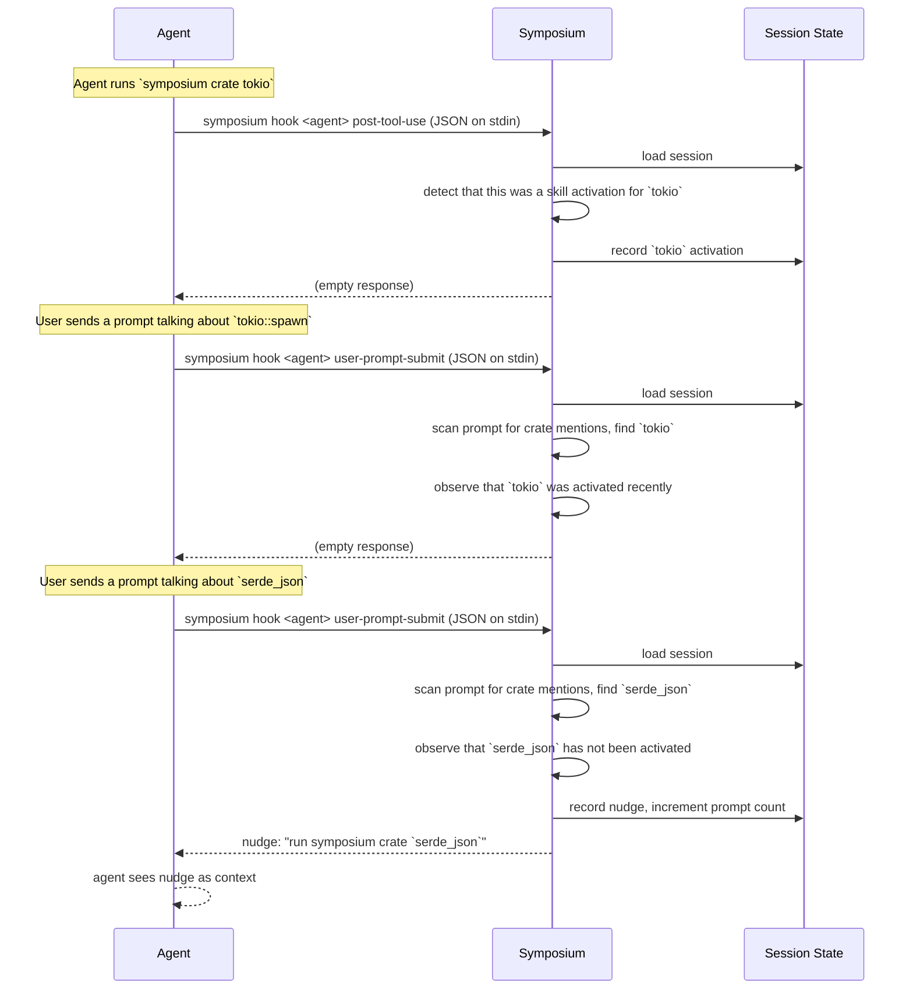

# Skill nudges

Symposium uses two hooks to monitor the user's prompts and tool usages, looking for

* times when the user appears to be talking about a crate in the current workspace
* times when the agent asks for Symposium skill or reads from a Symposium skill file

If the user's prompt talks about a crate in the current workspace but the skill has not yet been loaded, we'll add some advice to encourage the agent to load that skill. To do this, we load and store [session state](./session-state.md).

**PostToolUse** tracks activations. When the agent successfully runs `symposium crate <name>` (via Bash or MCP) or reads a skill file, Symposium records it in the session so it knows which skills have already been loaded.

**UserPromptSubmit** handles nudging. It scans the user's prompt for crate names in code-like contexts (backticks, code blocks, Rust paths like `foo::bar`), checks which of those crates have available skills that haven't been loaded yet, and nudges the agent to load them. Nudges are rate-limited by the configurable `nudge-interval` (default: every 50 prompts).
