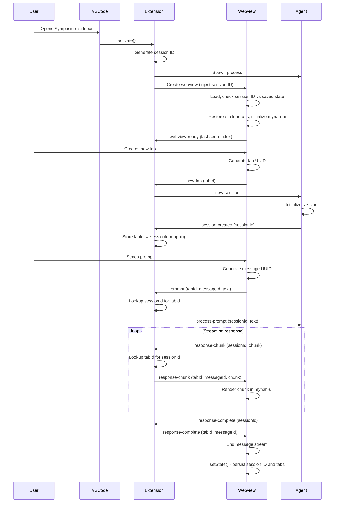

# VSCode Extension Architecture

The Symposium VSCode extension provides a chat interface for interacting with AI agents. The architecture divides responsibilities across three layers to handle VSCode's webview constraints while maintaining clean separation of concerns.

## Components Overview

**mynah-ui:** AWS's open-source chat interface library ([github.com/aws/mynah-ui](https://github.com/aws/mynah-ui)). Provides the chat UI rendering, tab management, and message display. The webview layer uses mynah-ui for all visual presentation.

**Agent:** Currently a mock implementation (HomerActor) that responds with Homer Simpson quotes. Future implementation will spawn an ACP-compatible agent process (see ACP Integration chapter when available).

**Extension activation:** VSCode activates the extension when the user first opens the Symposium sidebar or runs a Symposium command. The extension spawns the agent process during activation (or lazily on first use) and keeps it alive for the entire VSCode session.

## Three-Layer Model

```
┌─────────────────────────────────────────────────┐
│  Webview (Browser Context)                      │
│  - mynah-ui rendering                           │
│  - User interaction capture                     │
│  - Tab management                               │
└─────────────────┬───────────────────────────────┘
                  │ VSCode postMessage API
┌─────────────────▼───────────────────────────────┐
│  Extension (Node.js Context)                    │
│  - Message routing                              │
│  - Agent lifecycle                              │
│  - Webview lifecycle                            │
└─────────────────┬───────────────────────────────┘
                  │ Process spawning / stdio
┌─────────────────▼───────────────────────────────┐
│  Agent (Separate Process)                       │
│  - Session management                           │
│  - AI interaction                               │
│  - Streaming responses                          │
└─────────────────────────────────────────────────┘
```

## Why Three Layers?

### Webview Isolation

VSCode webviews run in isolated browser contexts without Node.js APIs. This security boundary prevents direct file system access, process spawning, or network operations. The webview can only communicate with the extension through VSCode's `postMessage` API.

**Design consequence:** UI code must be pure browser JavaScript. All privileged operations (spawning agents, workspace access, persistence) happen in the extension layer.

### Extension as Coordinator

The extension runs in Node.js with full VSCode API access. It bridges between the isolated webview and external agent processes.

**Key responsibilities:**
- **Message routing** - Translates between webview UI events and agent protocol messages
- **Agent lifecycle** - Spawns and manages the agent process
- **Webview lifecycle** - Handles visibility changes and ensures messages reach the UI

The extension deliberately avoids understanding message semantics. It routes based on IDs (tab ID, message ID) without interpreting content.

### Agent Independence

The agent runs as a separate process communicating via stdio. This isolation provides:

- **Flexibility** - Agent can be any executable (Rust, Python, TypeScript)
- **Stability** - Agent crashes don't kill the extension
- **Multiple sessions** - Single agent process handles all tabs/conversations

The agent owns all session state and conversation logic. The extension only tracks which tab corresponds to which session.

## Communication Boundaries

### Webview ↔ Extension

**Transport:** `postMessage` API (asynchronous, JSON-serializable messages only)

**Direction:**
- Webview → Extension: User actions (new tab, send prompt, close tab)
- Extension → Webview: Agent responses (response chunks, completion signals)

**Why not synchronous?** VSCode's webview API is inherently asynchronous. This forces the UI to be resilient to message delays and webview lifecycle events.

### Extension ↔ Agent

**Transport:** ACP (Agent Client Protocol) over stdio

**Direction:**
- Extension → Agent: Session commands (new session, process prompt)
- Agent → Extension: Streaming responses, session state updates

**Why ACP over stdio?** ACP provides a standardized protocol for agent communication. Stdio is simple, universal, and works with any language. No need for network sockets or IPC complexity.

## Agent Configuration and Sharing

The extension uses `AgentConfiguration` to determine when agent processes can be shared across tabs. An `AgentConfiguration` consists of:
- Agent name (e.g., "ElizACP", "Claude")
- Enabled components (e.g., "symposium-acp")
- Workspace folder (the VSCode workspace the agent operates in)

**Sharing strategy:** Tabs with identical configurations share the same agent actor (process), but each tab gets its own session within that process.

**Workspace folder selection:**
- Single workspace: Automatically uses that workspace
- Multiple workspaces: Prompts user to select which workspace folder to use
- Each session is created with the workspace folder as its working directory

**Rationale:**
- **Resource efficiency** - Shared actor means one process for multiple tabs with the same config
- **Workspace isolation** - Different workspace folders get different actors to maintain proper working directory context
- **Session isolation** - Each tab gets its own session ID for conversation independence

**Trade-off:** Agent must implement multiplexing. Messages include session/tab IDs for routing. Extension maps UI tab IDs to agent session IDs.

## Design Principles

**Opaque state:** Each layer owns its state format. Extension stores but doesn't parse webview UI state or agent session state.

**Graceful degradation:** Webview can be hidden/shown at any time. Extension buffers messages when webview is inactive.

**UUID-based identity:** Tab IDs and message IDs use UUIDs to avoid collisions. Generated at source (webview generates tab IDs, extension generates message IDs) to eliminate coordination overhead.

**Minimal coupling:** Layers communicate through well-defined message protocols. Webview doesn't know about agents. Agent doesn't know about webviews. Extension coordinates without understanding semantics.

## End-to-End Flow

Here's how a complete user interaction flows through the system:



The extension maintains tab↔session mappings and handles webview visibility, while the agent maintains session state and generates responses.
