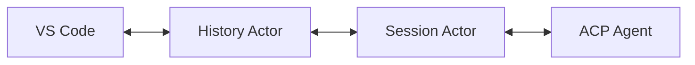
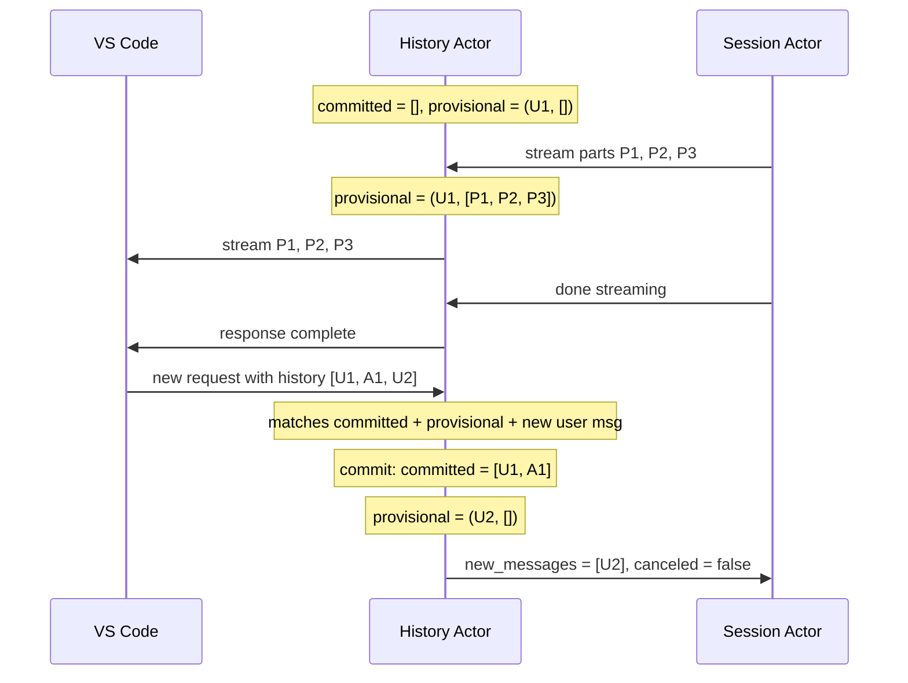
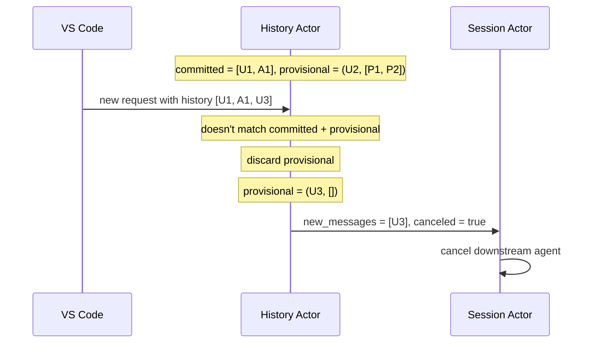

# Language Model Provider

> **Experimental:** This feature is disabled by default. Set `symposium.enableExperimentalLM: true` in VS Code settings to enable it.

This chapter describes the architecture for exposing ACP agents as VS Code Language Models via the `LanguageModelChatProvider` API (introduced in VS Code 1.104). This allows ACP agents to appear in VS Code's model picker and be used by any extension that consumes the Language Model API.

## Current Status

The Language Model Provider is experimental and may not be the right approach for Symposium.

**What works:**
- Basic message flow between VS Code LM API and ACP agents
- Session management with committed/provisional history model
- Tool bridging architecture (both directions)

**Known issues:**
- Tool invocation fails when multiple VS Code-provided tools are bridged to the agent. A single isolated tool works correctly, but when multiple tools are available, the model doesn't invoke them properly. The root cause is not yet understood.

**Open question:** VS Code LM consumers (like GitHub Copilot) inject their own context into requests - project details, file contents, editor state, etc. ACP agents like Claude Code also inject their own context. When both layers add context, they may "fight" each other, confusing the model. The LM API may be better suited for raw model access rather than wrapping agents that have their own context management.

## Overview

The Language Model Provider bridges VS Code's stateless Language Model API to ACP's stateful session model. When users select "Symposium" in the model picker, requests are routed through Symposium to the configured ACP agent.

```
┌─────────────────────────────────────────────────────────────────┐
│                         VS Code                                 │
│  ┌───────────────────────────────────────────────────────────┐  │
│  │              Language Model Consumer                       │  │
│  │         (Copilot, other extensions, etc.)                 │  │
│  └─────────────────────────┬─────────────────────────────────┘  │
│                            │                                    │
│                            ▼                                    │
│  ┌───────────────────────────────────────────────────────────┐  │
│  │           LanguageModelChatProvider (TypeScript)          │  │
│  │                                                           │  │
│  │  - Thin adapter layer                                     │  │
│  │  - Serializes VS Code API calls to JSON-RPC               │  │
│  │  - Forwards to Rust process                               │  │
│  │  - Deserializes responses, streams back via progress      │  │
│  └─────────────────────────┬─────────────────────────────────┘  │
└────────────────────────────┼────────────────────────────────────┘
                             │ JSON-RPC (stdio)
                             ▼
┌─────────────────────────────────────────────────────────────────┐
│              symposium-acp-agent vscodelm                       │
│                                                                 │
│  - Receives serialized VS Code LM API calls                    │
│  - Manages session state                                        │
│  - Routes to ACP agent (or Eliza for prototype)                │
│  - Streams responses back                                       │
└─────────────────────────────────────────────────────────────────┘
```

## Design Decisions

### TypeScript/Rust Split

The TypeScript extension is a thin adapter:
- Registers as `LanguageModelChatProvider`
- Serializes `provideLanguageModelChatResponse` calls to JSON-RPC
- Sends to Rust process over stdio
- Deserializes responses and streams back via `progress` callback

The Rust process handles all logic:
- Session management
- Message history tracking
- ACP protocol (future)
- Response streaming

This keeps the interesting logic in Rust where it's testable and maintainable.

### Session Management

VS Code's Language Model API is stateless: each request includes the full message history. ACP sessions are stateful. The Rust backend bridges this gap using a **History Actor** that tracks session state.

#### Architecture



- **History Actor**: Receives requests from VS Code, tracks message history, identifies new messages
- **Session Actor**: Manages the ACP agent connection, handles streaming responses

#### Committed and Provisional History

The History Actor maintains two pieces of state:

- **Committed**: Complete `(User, Assistant)*` message pairs that VS Code has acknowledged. Always ends with an assistant message (or is empty).
- **Provisional**: The current in-flight exchange: one user message `U` and the assistant response parts `A` we've sent so far (possibly empty).

#### Commit Flow

When we receive a new request, we compare its history against `committed + provisional`:



The new user message `U2` confirms that VS Code received and accepted our assistant response `A1`. We commit the exchange and start fresh with `U2`.

#### Cancellation via History Mismatch

If VS Code sends a request that doesn't include our provisional content, the provisional work was rejected:



This happens when:
- User cancels the chat in VS Code
- User rejects a tool confirmation
- User sends a different message while we were responding

The Session Actor receives `canceled = true` and propagates cancellation to the downstream ACP agent.

### Agent Configuration

The agent to use is specified per-request via the `agent` field in the JSON-RPC protocol. This is an `AgentDefinition` enum:

```typescript
type AgentDefinition =
  | { eliza: { deterministic?: boolean } }
  | { mcp_server: McpServerStdio };

interface McpServerStdio {
  name: string;
  command: string;
  args: string[];
  env: Array<{ name: string; value: string }>;
}
```

The TypeScript extension reads the agent configuration from VS Code settings via the agent registry, resolves the distribution to get the actual command, and includes it in each request. The Rust backend dispatches based on the variant:

- **`eliza`**: Uses the in-process Eliza chatbot (useful for testing)
- **`mcp_server`**: Spawns an external ACP agent process and manages sessions

## JSON-RPC Protocol

The protocol between TypeScript and Rust mirrors the `LanguageModelChatProvider` interface.

### Requests (TypeScript → Rust)

**`lm/provideLanguageModelChatResponse`**

Each request includes the agent configuration via the `agent` field, which is an `AgentDefinition` enum with two variants:

**External ACP agent (mcp_server)**:
```json
{
  "jsonrpc": "2.0",
  "id": 1,
  "method": "lm/provideLanguageModelChatResponse",
  "params": {
    "modelId": "symposium",
    "messages": [
      { "role": "user", "content": [{ "type": "text", "value": "Hello" }] }
    ],
    "agent": {
      "mcp_server": {
        "name": "my-agent",
        "command": "/path/to/agent",
        "args": ["--flag"],
        "env": [{ "name": "KEY", "value": "value" }]
      }
    }
  }
}
```

**Built-in Eliza (for testing)**:
```json
{
  "jsonrpc": "2.0",
  "id": 1,
  "method": "lm/provideLanguageModelChatResponse",
  "params": {
    "modelId": "symposium-eliza",
    "messages": [
      { "role": "user", "content": [{ "type": "text", "value": "Hello" }] }
    ],
    "agent": {
      "eliza": { "deterministic": true }
    }
  }
}
```

The Rust backend dispatches based on the variant - spawning an external process for `mcp_server` or using the in-process Eliza for `eliza`.

### Notifications (Rust → TypeScript)

**`lm/responsePart`** - Streams response chunks
```json
{
  "jsonrpc": "2.0",
  "method": "lm/responsePart",
  "params": {
    "requestId": 1,
    "part": { "type": "text", "value": "How " }
  }
}
```

**`lm/responseComplete`** - Signals end of response
```json
{
  "jsonrpc": "2.0",
  "method": "lm/responseComplete",
  "params": {
    "requestId": 1
  }
}
```

### Response

After all parts are streamed, the request completes:
```json
{
  "jsonrpc": "2.0",
  "id": 1,
  "result": {}
}
```

## Implementation Status

- [x] Rust: `vscodelm` subcommand in symposium-acp-agent
- [x] Rust: JSON-RPC message parsing
- [x] Rust: Eliza integration for testing
- [x] Rust: Response streaming
- [x] Rust: Configurable agent backend (McpServer support)
- [x] Rust: Session actor with ACP session management
- [x] TypeScript: LanguageModelChatProvider registration
- [x] TypeScript: JSON-RPC client over stdio
- [x] TypeScript: Progress callback integration
- [x] TypeScript: Agent configuration from settings
- [ ] End-to-end test with real ACP agent

## Tool Bridging

See [Language Model Tool Bridging](./lm-tool-bridging.md) for the design of how tools flow between VS Code and ACP agents. This covers:

- VS Code-provided tools (shuttled to agent via synthetic MCP server)
- Agent-internal tools (permission requests surfaced via `symposium-agent-action`)
- Handle state management across requests
- Cancellation and history matching

## Future Work

- Session caching with message history diffing
- Token counting heuristics
- Model metadata from agent capabilities
