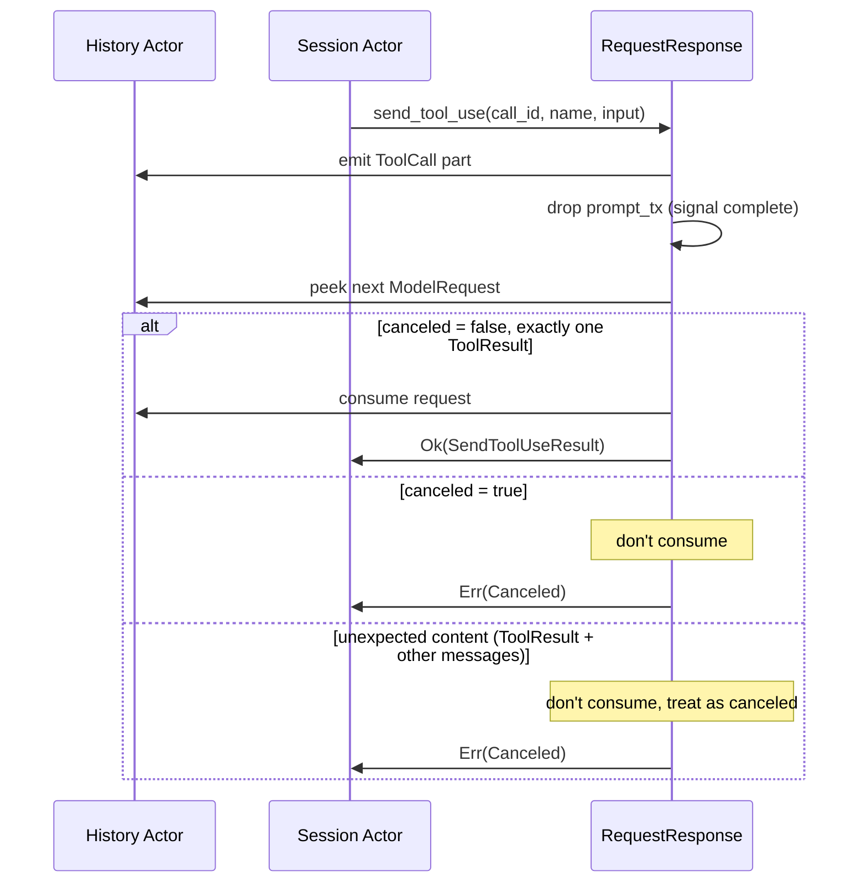

# Language Model Tool Bridging

This chapter describes how Symposium bridges tool calls between VS Code's Language Model API and ACP agents. For the general session management model (committed/provisional history), see [Language Model Provider](./lm-provider.md).

## Tool Call Categories

There are two categories of tools:

1. **Agent-internal tools** - Tools the ACP agent manages via its own MCP servers (e.g., bash, file editing)
2. **VS Code-provided tools** - Tools that VS Code extensions offer to the model

## Agent-Internal Tools

ACP agents have their own MCP servers providing tools. The agent can execute these directly, but may request permission first via ACP's `session/request_permission`.

When an agent requests permission, Symposium surfaces this to VS Code using a special tool called `symposium-agent-action`.

### How Tool Calls Fit the Session Model

A tool call creates a multi-step exchange within the committed/provisional model:

1. User sends message `U1` → provisional = `(U1, [])`
2. Agent streams response, ends with tool call → provisional = `(U1, [text..., ToolCall])`
3. VS Code shows confirmation UI, user approves
4. VS Code sends new request with `[U1, A1, ToolResult]`
5. `ToolResult` is a new user message, so we commit `(U1, A1)` → committed = `[U1, A1]`, provisional = `(ToolResult, [])`
6. Agent continues with the tool result

The key insight: **the tool result is just another user message** from the session model's perspective. It triggers a commit of the previous exchange.

### Permission Approved Flow

### Permission Rejected Flow

When the user rejects a tool (or cancels the chat), VS Code sends a request that doesn't include our tool call:

### Session Actor Tool Use Handling

The Session Actor uses a peek/consume pattern when waiting for tool results:

When `Err(Canceled)` is returned:
1. The outer loop cancels the downstream agent
2. It loops around and sees the unconsumed `ModelRequest`
3. Processes new messages, ignoring orphaned `ToolResult` parts
4. Starts a fresh prompt

The "unexpected content" case handles the edge case where VS Code sends both a tool result and additional user content. Rather than trying to handle this complex state, we treat it as a soft cancellation and start fresh.

## VS Code-Provided Tools

VS Code consumers pass tools to the model via `options.tools[]` in each request. These are tools implemented by VS Code extensions (e.g., "search workspace", "read file").

To expose these to an ACP agent, Symposium creates a **synthetic MCP server** that:

1. Offers the same tools that VS Code provided
2. When the agent invokes a tool, emits a `ToolCall` to VS Code and waits
3. Returns the result from VS Code to the agent

### VS Code Tool Flow

## Implementation Status

### Agent-Internal Tools (Implemented)

The permission flow for agent-internal tools is implemented:

- **TypeScript**: `symposium-agent-action` tool in `agentActionTool.ts`
- **Rust**: Session actor handles `session/request_permission`, emits `ToolCall` parts
- **History matching**: History actor tracks committed/provisional, detects approval/rejection

### VS Code-Provided Tools (Implemented)

The synthetic MCP server for bridging VS Code-provided tools is implemented:

- **Rust**: `VscodeToolsMcpServer` in `vscodelm/vscode_tools_mcp.rs` implements `rmcp::ServerHandler`
- **Integration**: Session actor creates one MCP server per session, injects it via `with_mcp_server()`
- **Tool list**: Updated on each VS Code request via `VscodeToolsHandle`
- **Tool invocation**: Session actor handles invocations from the MCP server using `tokio::select!`, emits `ToolCall` to VS Code, waits for `ToolResult`

## Limitations

### VS Code Tool Rejection Cancels Entire Chat

When a user rejects a tool in VS Code's confirmation UI, the entire chat is cancelled. This is a VS Code limitation ([GitHub #241039](https://github.com/microsoft/vscode/issues/241039)). Symposium handles this by detecting the cancellation via history mismatch.

### No Per-Tool Rejection Signaling

VS Code doesn't tell the model that a tool was rejected - the cancelled turn simply doesn't appear in history. The model has no memory of what it tried.

### Tool Approval Levels Managed by VS Code

VS Code manages approval persistence (single use, session, workspace, always). Symposium just receives the result.
