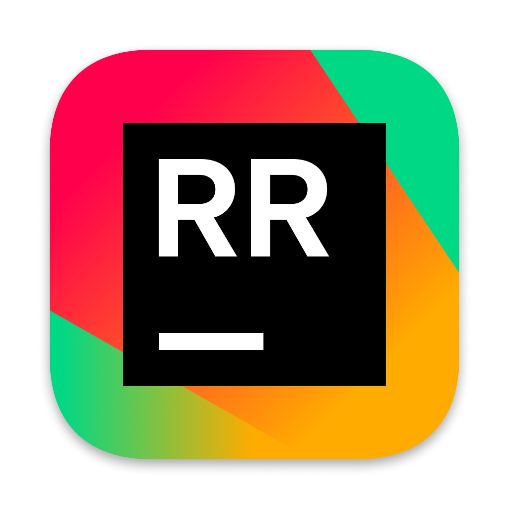
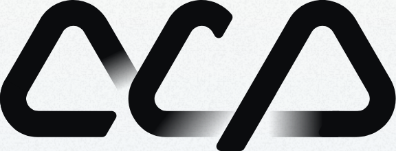

# How to install

## Install in your favorite editor

<ul class="editor-list">
  <li>
    <a href="./install-vscode.md">
      
      <span class="editor-name">VSCode</span>
    </a>
  </li>
  <li>
    <a href="./install-other.md">
      
      <span class="editor-name">Zed</span>
    </a>
  </li>
  <li>
    <a href="./install-other.md">
      
      <span class="editor-name">RustRover</span>
    </a>
  </li>
  <li>
    <a href="./install-other.md">
      
      <span class="editor-name">NeoVim</span>
    </a>
  </li>
  <li>
    <a href="./install-other.md">
      
      <span class="editor-name">Emacs</span>
    </a>
  </li>
  <li>
    <a href="./install-other.md">
      
      <span class="editor-name">Other ACP-supporting editors</span>
    </a>
  </li>
</ul>

## Installing from source

Clone the repository and use the setup tool:

```bash
git clone https://github.com/symposium-dev/symposium.git
cd symposium
cargo setup --all
```

### Setup options

| Option | Description |
|--------|-------------|
| `--all` | Install everything (ACP binaries, VSCode extension, Zed config) |
| `--acp` | Install ACP binaries only |
| `--vscode` | Build and install VSCode extension |
| `--zed` | Configure Zed editor |
| `--dry-run` | Show what would be done without making changes |

Options can be combined:

```bash
cargo setup --acp --zed    # Install ACP binaries and configure Zed
```

For editors other than VSCode and Zed, you need to manually configure your editor to run `symposium-acp-agent act-as-configured`.
