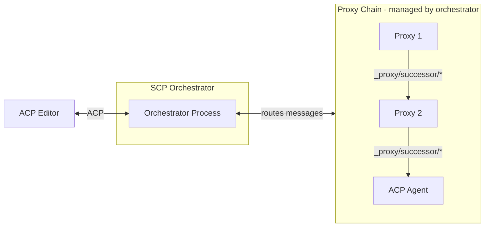
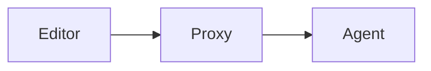

# Elevator pitch

> What are you proposing to change?

We propose to prototype **S/ACP** (Symposium ACP), an extension to Zed's Agent Client Protocol (ACP) that enables composable agent architectures through proxy chains. Instead of building monolithic AI tools, S/ACP allows developers to create modular components that can intercept and transform messages flowing between editors and agents.

This RFD builds on the concepts introduced in [SymmACP: extending Zed's ACP to support Composable Agents](https://smallcultfollowing.com/babysteps/blog/2025/10/08/symmacp), with the protocol renamed to S/ACP for this implementation.

Key changes:
* Define a proxy chain architecture where components can transform ACP messages
* Create an orchestrator that manages the proxy chain and presents as a normal ACP agent to editors
* Establish the `_proxy/successor/*` protocol for proxies to communicate with downstream components
* Enable composition without requiring editors to understand SCP internals

# Status quo

> How do things work today and what problems does this cause? Why would we change things?

Today's AI agent ecosystem is dominated by monolithic agents. We want people to be able to combine independent components to build custom agents targeting their specific needs. We want them to be able to use these with whatever editors and tooling they have. This is aligned with Symposium's core values of openness, interoperability, and extensibility.

# Motivating Example: Sparkle Integration

Consider integrating Sparkle (a collaborative AI framework) into a coding session with Zed and Claude. Sparkle provides an MCP server with tools, but requires an initialization sequence to load patterns and set up collaborative context.

**Without S/ACP:**
- Users must manually run the initialization sequence each session
- Or use agent-specific hooks (Claude Code has them, but not standardized across agents)
- Or modify the agent to handle initialization automatically
- Result: Manual intervention required, agent-specific configuration, no generic solution

**With S/ACP:**
```
Zed → Fiedler → Sparkle Component → Claude
               ↓
          Sparkle MCP Server
```

The Sparkle component:
1. Injects Sparkle MCP server into Claude's tool list during `initialize`
2. Intercepts the first `prompt` and prepends Sparkle embodiment sequence
3. Passes all other messages through transparently

From Zed's perspective, it talks to a normal ACP agent. From Claude's perspective, it has Sparkle tools available. No code changes required on either side.

This demonstrates S/ACP's core value: adding capabilities through composition rather than modification.

# What we propose to do about it

> What are you proposing to improve the situation?

We propose to develop  an [extension to ACP](https://agentclientprotocol.com/protocol/extensibility) called **SCP (Symposium Component Protocol)**.

The heart of SCP is a proxy chain where each component adds specific capabilities:



SCP defines three kinds of actors:

* **Editors** spawn the orchestrator and communicate via standard ACP
* **Orchestrator** manages the proxy chain, appears as a normal ACP agent to editors
* **Proxies** intercept and transform messages, communicate with downstream via `_proxy/successor/*` protocol
* **Agents** provide base AI model behavior using standard ACP

The orchestrator handles message routing, making the proxy chain transparent to editors. Proxies can transform requests, responses, or add side-effects without editors or agents needing SCP awareness.

## The Orchestrator: Fiedler

S/ACP's orchestrator is called **Fiedler** (after Arthur Fiedler, conductor of the Boston Pops). Fiedler has three responsibilities:

1. **Process Management** - Creates and manages component processes based on command-line configuration
2. **Message Routing** - Routes messages between editor, components, and agent through the proxy chain
3. **Capability Adaptation** - Observes component capabilities and adapts between them

**Example adaptation:** Session pre-population
- If the agent supports native session pre-population, Fiedler uses it
- If not, Fiedler synthesizes a dummy prompt with history in XML/markdown, intercepts the response, discards it, then starts the real session
- Result: Components can use session pre-population even with agents that don't support it

Other adaptations include translating streaming support, content types, and tool formats.

**From the editor's perspective**, it spawns one Fiedler process and communicates using normal ACP over stdio. The editor doesn't know about the proxy chain.

**Command-line usage:**
```bash
fiedler sparkle-acp claude-code-acp
```

Fiedler advertises an `"orchestrator"` capability during ACP initialization, but editors can treat it as any other ACP agent.


# Shiny future

> How will things will play out once this feature exists?

## Composable Agent Ecosystems

SCP enables a marketplace of reusable proxy components. Developers can:
* Compose custom agent pipelines from independently-developed proxies
* Share proxies across different editors and agents
* Test and debug proxies in isolation
* Mix community-developed and custom proxies

## Simplified Agent Development

Agent developers can focus on core model behavior without implementing cross-cutting concerns:
* Logging, metrics, and observability become proxy responsibilities
* Rate limiting and caching handled externally
* Content filtering and safety policies applied consistently

## Editor Simplicity

Editors gain enhanced functionality without custom integrations:
* Add sophisticated agent behaviors by changing proxy chain configuration
* Support new agent features without editor updates
* Maintain compatibility with any ACP agent

## Standardization Path

As the ecosystem matures, successful patterns may be:
* Standardized in ACP specification itself
* Adopted by other agent protocols
* Used as reference implementations for proxy architectures

## Protocol Extensions

Near-term extensions under consideration:

**Tool Interception** - Route MCP tool calls through the proxy chain instead of directly to external servers. Fiedler registers as a dummy MCP server, and tool calls route back through components for handling. This enables components to provide tools without agents needing S/ACP awareness.

**Agent-Initiated Messages** - Allow components to send messages after the agent has sent end-turn, outside the normal request-response cycle. Use cases include background task completion notifications, time-based reminders, or autonomous checkpoint creation.

**Session Pre-Population** - Create sessions with existing conversation history. Fiedler adapts based on agent capabilities: uses native support if available, otherwise synthesizes a dummy prompt containing the history, intercepts the response, and starts the real session.

**Rich Content Types** - Extend content types beyond text to include HTML panels, interactive GUI components, or other structured formats. Components can transform between content types based on what downstream agents support.

# Implementation details and plan

> Tell me more about your implementation. What is your detailed implementaton plan?

The implementation focuses on building Fiedler and demonstrating the Sparkle integration use case.

## SCP protocol

### Definition: Editor vs Agent of a proxy

For an SCP proxy, the "editor" is defined as the upstream connection and the "agent" is the downstream connection.



### SCP editor capabilities

An SCP-aware editor provides the following capability during ACP initialization:

```json
/// Including the symposium section *at all* means that the editor
/// supports symposium proxy initialization.
"_meta": {
    "symposium": {
        "version": "1.0",
        "html_panel": true,      // or false, if this is the ToEditor proxy
        "file_comment": true,    // or false, if this is the ToEditor proxy
    }
}
```

SCP proxies forward the capabilities they receive from their editor.

### SCP component capabilities

SCP components advertise their role during ACP initialization:

**Orchestrator capability:**
```json
"_meta": {
    "symposium": {
        "version": "1.0",
        "orchestrator": true
    }
}
```

**Proxy capability:**
```json
"_meta": {
    "symposium": {
        "version": "1.0",
        "proxy": true
    }
}
```

**Agent capability:**
Agents don't need special SCP capabilities - they're just normal ACP agents.

### The `_proxy/successor/{send,receive}` protocol

Proxies communicate with their downstream component (next proxy or agent) through special extension messages handled by the orchestrator:

**`_proxy/successor/send/request`** - Proxy wants to send a request downstream:
```json
{
  "method": "_proxy/successor/send/request",
  "params": {
    "message": <ACP_REQUEST>
  }
}
```

**`_proxy/successor/send/notification`** - Proxy wants to send a notification downstream:
```json
{
  "method": "_proxy/successor/send/notification",
  "params": {
    "message": <ACP_NOTIFICATION>
  }
}
```

**`_proxy/successor/receive/request`** - Orchestrator delivers a request from downstream:
```json
{
  "method": "_proxy/successor/receive/request",
  "params": {
    "message": <ACP_REQUEST>
  }
}
```

**`_proxy/successor/receive/notification`** - Orchestrator delivers a notification from downstream:
```json
{
  "method": "_proxy/successor/receive/notification",
  "params": {
    "message": <ACP_NOTIFICATION>
  }
}
```

**Message flow example:**
1. Editor sends ACP `prompt` request to orchestrator
2. Orchestrator forwards to Proxy1 as normal ACP message
3. Proxy1 transforms and sends `_proxy/successor/send/request { message: <modified_prompt> }`
4. Orchestrator routes that to Proxy2 as normal ACP `prompt`
5. Eventually reaches agent, response flows back through chain
6. Orchestrator wraps responses going upstream appropriately

**Transparent proxy pattern:**
A pass-through proxy is trivial - just forward everything:
```rust
match message {
    // Forward requests from editor to successor
    AcpRequest(req) => send_to_successor_request(req),
    
    // Forward notifications from editor to successor
    AcpNotification(notif) => send_to_successor_notification(notif),

    // Forward from successor back to editor
    ExtRequest("_proxy/successor/receive/request", msg) => respond_to_editor(msg),
    ExtNotification("_proxy/successor/receive/notification", msg) => forward_to_editor(msg),
}
```

### Additional Extension Messages

Proxies can define their own extension messages beyond `_proxy/successor/*` to provide specific capabilities. Examples might include:

* **Logging/observability**: `_proxy/log` messages for structured logging
* **Metrics**: `_proxy/metric` messages for tracking usage
* **Configuration**: `_proxy/config` messages for dynamic reconfiguration

The orchestrator can handle routing these messages appropriately, or they can be handled by specific proxies in the chain.

These extensions are beyond the scope of this initial RFD and will be defined as needed by specific proxy implementations.

# Implementation progress

> What is the current status of implementation and what are the next steps?

## Current Status: Implementation Phase

**Completed:**
- ✅ S/ACP protocol design with Fiedler orchestrator architecture
- ✅ `_proxy/successor/{send,receive}` message protocol defined
- ✅ `scp` Rust crate with JSON-RPC layer and ACP message types
- ✅ Comprehensive JSON-RPC test suite (21 tests)
- ✅ Proxy message type definitions (`ToSuccessorRequest`, etc.)

**In Progress:**
- Fiedler orchestrator implementation
- Sparkle S/ACP component

## Phase 1: Minimal Sparkle Demo (CURRENT)

**Goal:** Demonstrate Sparkle integration through S/ACP composition.

**Components:**
1. **Fiedler orchestrator** - Process management, message routing, capability adaptation
2. **Sparkle S/ACP component** - Injects Sparkle MCP server, handles embodiment sequence
3. **Integration test** - Validates end-to-end flow with mock editor/agent

**Demo flow:**
```
Zed → Fiedler → Sparkle Component → Claude
               ↓
          Sparkle MCP Server
```

**Success criteria:**
- Sparkle MCP server appears in Claude's tool list
- First prompt triggers Sparkle embodiment sequence
- Subsequent prompts work normally
- All other ACP messages pass through unchanged

## Phase 2: Tool Interception (FUTURE)

**Goal:** Route MCP tool calls through the proxy chain.

Fiedler registers as a dummy MCP server. When Claude calls a Sparkle tool, the call routes back through the proxy chain to the Sparkle component for handling. This enables richer component interactions without requiring agents to understand S/ACP.

## Phase 3: Additional Components (FUTURE)

Build additional S/ACP components that demonstrate different use cases:
- Session history/context management
- Logging and observability
- Rate limiting
- Content filtering

These will validate the protocol design and inform refinements.

## Testing Strategy

**Unit tests:**
- Test message serialization/deserialization
- Test process spawning logic
- Test stdio communication

**Integration tests:**
- Spawn real proxy chains
- Use actual ACP agents for end-to-end validation
- Test error handling and cleanup

**Manual testing:**
- Use with VSCode + ACP-aware agents
- Verify with different proxy configurations
- Test process management under various failure modes

# Frequently asked questions

> What questions have arisen over the course of authoring this document or during subsequent discussions?

## What alternative approaches did you consider, and why did you settle on this one?

We considered extending MCP directly, but MCP is focused on tool provision rather than conversation flow control. We also looked at building everything as VSCode extensions, but that would lock us into a single editor ecosystem.

SCP's proxy chain approach provides the right balance of modularity and compatibility - components can be developed independently while still working together.

## How does this relate to other agent protocols like Google's A2A?

SCP is complementary to protocols like A2A. While A2A focuses on agent-to-agent communication for remote services, SCP focuses on composing the user-facing development experience. You could imagine SCP components that use A2A internally to coordinate with remote agents.

## What about security concerns with arbitrary proxy chains?

Users are responsible for the proxies they choose to run, similar to how they're responsible for the software they install. Proxies can intercept and modify all communication, so trust is essential. For future versions, we're considering approaches like Microsoft's Wassette (WASM-based capability restrictions) to provide sandboxed execution environments.

## What about the chat GUI interface?

We currently have a minimal chat GUI working in VSCode that can exchange basic messages with ACP agents. However, a richer chat interface with features like message history, streaming support, context providers, and interactive elements remains TBD.

Continue.dev has solved many of the hard problems for production-quality chat interfaces in VS Code extensions. Their GUI is specifically designed to be reusable - they use the exact same codebase for both VS Code and JetBrains IDEs by implementing different adapter layers.

Their architecture proves that message-passing protocols can cleanly separate GUI concerns from backend logic, which aligns perfectly with SCP's composable design. When we're ready to enhance the chat interface, we can evaluate whether to build on Continue.dev's foundation or develop our own approach based on what we learn from the SCP proxy framework.

The Apache 2.0 license makes this legally straightforward, and their well-documented message protocols provide a clear integration path.

## Why not just use hooks or plugins?

Hooks are fundamentally limited to what the host application anticipated. SCP proxies can intercept and modify the entire conversation flow, enabling innovations that the original tool designer never envisioned. This is the difference between customization and true composability.

## What about performance implications of the proxy chain?

The proxy chain does add some latency as messages pass through multiple hops. However, we don't expect this to be noticeable for typical development workflows. Most interactions are human-paced rather than high-frequency, and the benefits of composability outweigh the minimal latency cost.

## How will users discover and configure proxy chains?

This will be determined over time as the ecosystem develops. We expect solutions to emerge organically, potentially including registries, configuration files, or marketplace-style discovery mechanisms.

## What about resource management with multiple proxy processes?

Each proxy manages the lifecycle of processes it starts. When a proxy terminates, it cleans up its downstream processes. This creates a natural cleanup chain that prevents resource leaks.

# Revision history

Initial draft based on architectural discussions.
